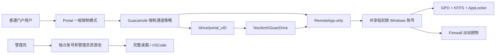

# Technical Design: RemoteApp GuacDrive 一般访问限制

## 1. Core judgment

当前 GuacDrive 结构继续保留。一般限制的目标不是建立恶意程序不可突破的 OS 沙箱，而是通过 Portal fail-closed、Guacamole 通道收紧、Windows GPO、NTFS、AppLocker、网络限制和会话清理，使普通用户正常工作时只能使用自己的 GuacDrive，并阻断主要逃逸路径。

## 2. Target boundary

管理员连接域与普通连接域必须使用不同 Windows 身份和资源配置。普通用户之间仍共享低权限 Windows 身份，因此该设计不承诺 profile、注册表和允许应用内部的强多租户隔离。

## 3. Security modes

### `restricted_remoteapp`

- 普通用户使用。
- `remote_app` 必填。
- 强制关闭剪贴板、浏览器上传/下载、打印、音频输入和非必要通道。
- 只允许 AppLocker 白名单中的业务 RemoteApp。
- 使用共享低权限 Windows 账号。

### `admin_desktop`

- 仅管理员使用。
- 可以包含完整桌面、VSCode、脚本和管理工具。
- 使用独立 Windows 账号、ACL 和资源池。
- 不得与普通用户共享 ACL 或凭据。

不再提供含义模糊的“普通应用但可能回退桌面”模式。

## 4. Control layers

### 4.1 Portal

- 普通用户 ACL 不包含完整桌面和 VSCode。
- 保存和启动 `restricted_remoteapp` 时校验 `remote_app` 非空。
- 强制通道参数不能被应用级 override 放宽。
- 管理端展示安全模式、不兼容原因和最终生效参数。
- 审计记录门户用户、应用、资源、会话和安全模式。

### 4.2 Guacamole/RDP

- 保留 per-user `drive-path=/drive/portal_u{user_id}`。
- 保持 `enable-drive=true`，因为 GuacDrive 依赖 RDPDR。
- 强制关闭 copy/paste、browser upload/download、printing、audio input。
- 不依赖隐藏 Guacamole 菜单或 iframe CSS 作为安全边界。

### 4.3 Windows GPO

- 对共享低权限账号或用户组启用 RDS Session Host loopback GPO。
- 隐藏并从 Explorer 限制本地盘；移除 Run、控制面板、任务管理器和网络驱动器映射入口。
- 禁止保存最近文件、清理会话历史和临时文件。
- 盘符隐藏只作为 UX 和常见入口控制，不作为最终访问判定。

### 4.4 NTFS

- Windows 与 Program Files 保持必要 Read & Execute。
- 普通账号不得写入系统目录和应用安装目录。
- 对其他用户 profile、业务数据卷、备份目录和管理员工具目录移除访问。
- profile/temp 仅允许应用运行所需的最小写权限，并由清理任务回收。

### 4.5 AppLocker

- 先 Audit 收集真实 RemoteApp、DLL、脚本和子进程。
- 再对可执行文件、脚本、MSI 和 packaged app 规则切 Enforced。
- 拒绝 Explorer、cmd、PowerShell、wscript/cscript、mshta、mmc、安装器和通用 IDE。
- 保留带外管理员恢复账号；WDAC 作为后续硬隔离升级方案。

### 4.6 Network

- 阻断 SMB 445/139、WebDAV、管理员共享和非必要外联。
- 许可证服务器、数据库和业务服务按 HOST/PORT allowlist。
- 如应用需要 HTTP(S)，按目标域/IP 细化，不开放任意互联网出口。

## 5. Current application classification

| Current application | Proposed mode | Reason |
|---|---|---|
| 记事本 | restricted_remoteapp pilot | 能验证打开/保存与 GuacDrive 正向路径 |
| 计算器 | restricted_remoteapp smoke | 无文件业务价值，只用于启动与通道测试 |
| 远程桌面 | admin_desktop | 空 remote_app，属于完整桌面候选 |
| 验证节点-桌面与脚本 | admin_desktop | 桌面和脚本能力与一般限制目标冲突 |
| VSCode | admin_desktop | 终端、任务、插件和文件 API 能力过宽 |

后续仿真软件必须逐个在 AppLocker Audit 中收集依赖，不能因为是 RemoteApp 就自动认定适合一般限制。

## 6. Rollout

### Stage A: Configuration containment

- 普通用户移除完整桌面、验证桌面和 VSCode ACL。
- 普通 RemoteApp 统一关闭剪贴板、打印、音频输入和浏览器传输。
- 管理员连接迁入独立账号和资源池。

### Stage B: Windows pilot

- 先在一台主机和共享低权限账号落地 GPO、NTFS、Firewall、AppLocker Audit。
- 使用记事本和一个真实业务应用进行正向操作和逃逸测试。
- 依赖收敛后切换 AppLocker Enforced。

### Stage C: Portal enforcement

- 增加安全模式、强制参数和 fail-closed 校验。
- 管理 UI 显示普通与管理员连接域。
- 记录策略版本和阻断原因。

### Stage D: Expansion

- 每次只迁移一个应用或资源池。
- 真实浏览器、真实 RDP 会话和 Windows 审计同时验收。
- 高敏应用若残余风险不可接受，单独升级到独立账号/VM。

## 7. Rollback

- 规划前基线：`codex/backup-general-restriction-20260725`。
- 不执行整体硬重置作为常规回滚；优先按文件或提交恢复。
- Windows GPO/AppLocker 先试点 OU，保留前一版策略、Audit 模式和带外管理员入口。
- Portal 新安全模式默认不自动迁移现有记录，按应用灰度切换。

## 8. Residual risk

- 共享 Windows 账号意味着 profile、Temp、Recent、HKCU 和 Windows 审计身份仍然共享。
- 允许的应用如果存在宏、插件、任意文件 API 或代码执行能力，可能访问该共享账号仍有权限读取的路径。
- 因此验收结论只能是“正常流程和常见绕过受到限制”，不能写成“用户在任何情况下都只能访问 GuacDrive”。
