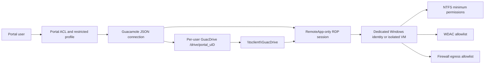

# Technical Design: RemoteApp GuacDrive 访问硬隔离

## 1. Core judgment

保留当前 GuacDrive 架构是对的：它已经把每个门户用户映射到独立的 `/drive/portal_u{user_id}`。需要补的不是另一套文件系统，而是 Windows 远程会话的安全边界。

推荐新增“受限工作区”安全域，采用五层同时生效：Portal fail-closed、Guacamole/RDP 通道最小化、Windows 身份隔离、NTFS + WDAC 强制执行、网络出口限制。任意一层单独使用都不足以承诺“只能主动访问 GuacDrive”。

## 2. Security boundary

安全定义不是“Windows 完全看不到 C 盘字母”，而是：用户驱动的文件访问只能成功落到自己的 GuacDrive；系统和应用依赖仍可按最小权限执行。

## 3. Current-state gaps

| Layer | Current behavior | Gap |
|---|---|---|
| Portal | ACL 控制应用可见性；文件 API 按 user_id 限制目录 | 不能约束 RemoteApp 对 Windows 本地盘/UNC 的直接访问 |
| Guacamole | 仅发布 `/drive/portal_u{user_id}`；全局关闭浏览器上传/下载 | 4/5 活跃应用仍开放剪贴板；通道参数不是 Windows ACL |
| RemoteApp | 3 个活跃连接配置了 remote_app | 2 个连接可退化为完整桌面；VSCode 本身是逃逸能力很强的通用工具 |
| Windows identity | 应用记录提供 RDP 凭据 | 运行库为 2 个门户用户共用 1 个 RDP 账号和 1 台主机 |
| Windows policy | 仓库没有 GPO/NTFS/WDAC/防火墙基线 | “隐藏盘符”仍可被程序 API、脚本和网络路径绕过 |
| Deployment | 正式 Compose 只暴露 Nginx | 旧根 Compose 仍暴露 8080，存在绕过 Portal 的错误部署路径 |

## 4. Recommended target architecture

### 4.1 Security modes

定义三个清晰模式，不混用：

1. `restricted_workspace`：普通用户，只允许受控 RemoteApp + GuacDrive。
2. `standard_remoteapp`：允许更宽松通道或通用工具，但不宣称只能访问 GuacDrive。
3. `admin_desktop`：完整桌面/VSCode/运维用途，只给管理员并使用独立账号、资源池和审计策略。

安全模式优先绑定到 Windows 身份/资源配置，再由应用引用。原因是 GPO、NTFS 和 WDAC 对账号或主机生效，仅在应用记录上加一个布尔开关会产生“Portal 显示受限、Windows 实际未受限”的假安全。

### 4.2 Windows identity choices

#### Recommended: per-user Windows identity

- Portal 用户与 Windows 域/本地账号建立一对一映射。
- `_build_all_connections(user_id)` 根据 `user_id + resource/host` 解析身份。
- 凭据使用受保护的 credential reference；不在 `remote_app` 表继续复制明文密码。
- 每个用户拥有独立 profile/temp/audit identity，GuacDrive 仍按现有 user_id 映射。

#### Stronger but costlier: per-session isolated VM/Worker

- 资源池为用户分配独占 Windows VM/Worker。
- 会话结束后回滚快照或销毁实例。
- 本地磁盘只含系统、应用和临时数据，跨用户残留风险最低。

#### Not sufficient for a hard claim: shared low-privilege account

- 可隐藏 C/D、关闭工具、阻断常见路径，适合演示或一般限制。
- 共享 profile、临时目录、注册表、会话历史和进程权限仍形成跨用户边界缺口。

### 4.3 Windows host policy

#### GPO / UX containment

- 对 `PortalRestrictedUsers` 使用 RDS Session Host OU + loopback processing。
- 配置“隐藏我的电脑中的指定驱动器”和“防止从我的电脑访问驱动器”。
- 移除 Run、映射网络驱动器、控制面板、任务管理器、命令提示符等入口。
- 这些只减少入口和误操作，验收不能只看图标是否消失。

#### NTFS enforcement

- 保持 Windows、Program Files 和目标应用目录的必要 Read & Execute。
- 普通用户不得写入系统目录；不得读取/列出其他用户 profile、业务数据卷、备份卷和管理员工具目录。
- 仅允许用户 profile 必需目录、应用缓存/临时目录和指定 app working directory；会话结束后清理。
- 不对整个 `C:\` 添加泛化 Deny，避免 Deny 覆盖应用依赖导致系统失效。

#### Application control

- 硬隔离使用 App Control for Business（WDAC）allowlist。
- 先以 Audit 模式采集目标 RemoteApp 的真实二进制、DLL、脚本和子进程，再切 Enforced。
- AppLocker 可用于试点和补充审计，但 Microsoft 明确将其定位为 defense-in-depth，不作为强边界的唯一控制。
- Restricted profile 禁止 Explorer、cmd、PowerShell、wscript/cscript、mshta、mmc、regedit、安装器、未授权 DLL/脚本和通用 IDE。

#### Network containment

- 默认阻断 SMB 445/139、WebDAV 和其他文件共享出口。
- 许可证服务器、计算服务、数据库和必要 HTTP(S) 目标按主机/端口 allowlist。
- 禁止映射网络驱动器和访问管理员共享。

### 4.4 Guacamole / RDP policy

- 继续启用 drive redirection，因为 GuacDrive 依赖它。
- 只由 Guacamole 发布唯一 drive path，不允许浏览器或用户增加其他客户端驱动器。
- Restricted profile 强制关闭 copy/paste、浏览器 upload/download、打印、音频输入和非必要设备通道。
- `disable-download/upload` 只控制浏览器传输；RemoteApp 对 `\\tsclient\GuacDrive` 的正常读写必须保留。

### 4.5 Portal fail-closed changes

- 管理模型增加安全模式和安全身份/资源绑定。
- Restricted profile 保存和启动时必须验证：`remote_app` 非空、应用在 WDAC allowlist、账号/主机合规、通道参数满足强制值。
- `remote_app_args` 改为受控模板或参数槽，不能接受任意 shell 命令。
- 对普通用户取消完整桌面和 VSCode ACL；如保留，迁移到 `admin_desktop`。
- 启动审计记录 `security_mode`、Windows identity/reference、resource member、policy version 和 `drive_path`。

## 5. Rollout strategy

### Stage A: Immediate containment

- 普通用户暂停访问完整桌面和 VSCode。
- 统一关闭普通连接的 copy/paste、打印、音频输入和浏览器传输通道。
- 只允许正式 `deploy/docker-compose.yml`，阻止旧 Compose 对外发布 8080。

### Stage B: One-host pilot

- 新建受限 Windows 用户组/OU 和一台试点 RDS 主机或 VM。
- 先部署 GPO、NTFS、防火墙与 WDAC Audit。
- 选择记事本或一个真实仿真应用做测试；不要用 VSCode 代表受限应用。
- 收集依赖后切换 WDAC Enforced，执行完整逃逸矩阵。

### Stage C: Portal enforcement

- 增加安全模式、身份映射、配置校验和审计字段。
- 迁移普通应用/ACL 到 restricted profile，管理连接迁移到 admin domain。
- 启动前进行主机合规门控，失败时拒绝而不是降级到普通桌面。

### Stage D: Scale and harden

- 推广到更多主机/应用。
- 对高敏应用采用每会话独占 VM/Worker。
- 建立策略版本、漂移检测、定期真实浏览器与 Windows 会话回归。

## 6. Compatibility and rollback

- 不改变 `/api/remote-apps`、GuacDrive 路径、token cache 和 Nginx 下载契约。
- 先新增安全模式，默认现有记录为 `standard_remoteapp`，避免未经验证直接锁死生产应用。
- 迁移按应用/资源池灰度；受限策略失败时回滚到独立试点主机，不能自动降级为完整桌面。
- WDAC 先 Audit 后 Enforced，并保留带外管理员恢复通道、策略签名与回滚文件。

## 7. Decision gate

实施前必须确认 Windows 身份方案。若不能采用每用户账号或独占 VM/Worker，本任务应明确降级为“界面隐藏 + 一般限制”，不能使用“硬隔离”验收标准。
