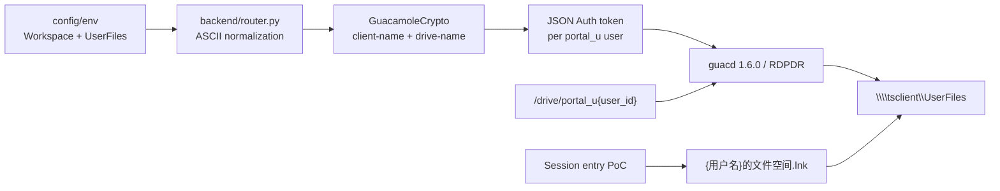

# Technical Design: RemoteApp 用户文件空间品牌隐藏与会话级友好名称

## 1. Core decision

The implementation separates the protocol transport name from the user-facing name:

```text
RDPDR internal client name: Workspace
RDPDR internal drive name:  UserFiles
Physical storage key:       /drive/portal_u{user_id}
Friendly Windows entry:     {display_name or username}的文件空间
```

Chinese names are not placed in Guacamole 1.6.0 `drive-name` or `client-name`. The upstream RDPDR implementation truncates multibyte UTF-8 drive names, and Windows combines the client and drive names in its shell display. The supported parameters can remove technology branding but cannot produce the exact final friendly label alone.

## 2. Data flow



## 3. Backend contracts

### 3.1 Configuration

- `guacamole.client_name` defaults to `Workspace`.
- `guacamole.drive.name` defaults to `UserFiles`.
- Optional deployment overrides are `GUACAMOLE_CLIENT_NAME` and `GUACAMOLE_DRIVE_NAME`.
- Environment values are not trusted as protocol-ready values; `backend/router.py` remains the normalization owner.

### 3.2 Normalization

- One shared ASCII-label helper replaces characters outside `[A-Za-z0-9._-]` with `_`, trims punctuation, enforces a maximum length, and returns a fixed fallback.
- Client names use a maximum of 31 ASCII characters to stay below Guacamole/FreeRDP's 32-byte hostname boundary.
- Drive names retain the existing repository maximum of 64 ASCII characters.

### 3.3 Connection generation

- `GuacamoleCrypto.build_rdp_connection()` gains `client_name` and emits `client-name` for every RDP connection.
- `drive-name` remains conditional on enabled drive redirection and a non-empty `drive-path`.
- The router uses one effective `drive_name` for RDPDR, default RemoteApp working directories, and restricted VSCode arguments.

### 3.4 Compatibility and cache

- Automatic paths include historical `GuacDrive`, `用户数据目录`, and the new `UserFiles` name.
- Explicit unrelated application directories are preserved.
- A new SQL migration sets historical automatic `remote_app_dir` values to `NULL` and deletes `token_cache`.
- Runtime rollout still requires restarting `portal-backend` and ending old Windows sessions.

## 4. Windows friendly-entry PoC

The PoC is deliberately independent from the planned generic runtime-profile Launcher.

### 4.1 Files

- `scripts/windows/PortalSessionFileSpace.psm1`: validation, naming, planning, shortcut creation, metadata, cleanup.
- `scripts/windows/set-portal-session-filespace-entry.ps1`: parameter binding and JSON output.
- `scripts/windows/migrate-portal-filespace-labels.ps1`: standalone administrator migration for Known Folders, MountPoints2, Recent links, and the File Explorer Quick Access cache.

### 4.2 Entry shape

```text
ROOT/
  session_{windows_session_id}_{portal_session_uuid}/
    {safe_display_name}的文件空间.lnk
    entry.json
```

The default root is under the current user's local application-data directory, but every operation may receive an explicit root for testing and deployment. No shared Desktop, Start Menu, Quick Access, or HKCU rename is used.

### 4.3 Input contract

- `Username`: required fallback identity.
- `DisplayName`: optional friendly identity.
- `PortalSessionId`: required UUID.
- `WindowsSessionId`: defaults to the current process session.
- `TargetPath`: defaults to and is restricted to `\\tsclient\UserFiles`.
- `Root`: optional drive-qualified local absolute root; drive-relative and UNC roots are rejected.
- Exported create/remove functions revalidate every calculated Plan field instead of trusting caller-supplied paths.
- `Remove`: removes only the calculated shortcut and metadata; it rejects reparse points or session directories containing unexpected files.

### 4.4 Security boundary

- The PoC prevents naming collisions, not cross-user authorization.
- Shared Windows accounts still share a SID and may access each other's local entry directories if they learn the path.
- The link target is a fixed UNC and never accepts arbitrary commands or executable arguments.
- Real production isolation remains owned by the separate Launcher/Agent/File Broker architecture.

## 5. Frontend and documentation

- User-facing help text says “个人文件空间” and does not expose the internal UNC.
- Admin working-directory help explains that an empty value automatically targets the current user's file space.
- Internal technical documentation may retain historical names only in explicitly historical sections.

## 6. Rollout and rollback

### Rollout

1. Apply the SQL migration.
2. Deploy matching Guacamole web/guacd 1.6.0 images and the new backend.
3. Restart `portal-backend` to clear the memory cache.
4. Run `migrate-portal-filespace-labels.ps1` as Windows administrator.
5. End accounts reported with `requires_logoff=true`, then relaunch RemoteApp.
6. Validate neutral labels and the per-session friendly-entry PoC with two concurrent users.

### Rollback

1. Stop creating PoC entries and remove current session entry directories.
2. Restore the previous config values if required.
3. Clear `token_cache`, restart `portal-backend`, and end old Windows sessions.
4. Do not change `/drive/portal_u{user_id}` or business files during rollback.

## 7. Known limitations

- The PoC does not guarantee that every third-party custom file picker renders `.lnk` entries like Windows Common Item Dialog.
- Until a session-aware real mount/File Broker replaces RDPDR, the neutral internal `Workspace/UserFiles` entry may remain visible elsewhere in Windows.
- Real RDS concurrent-session and target-application validation is required before calling the friendly entry production-ready.
