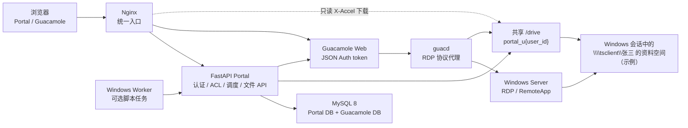
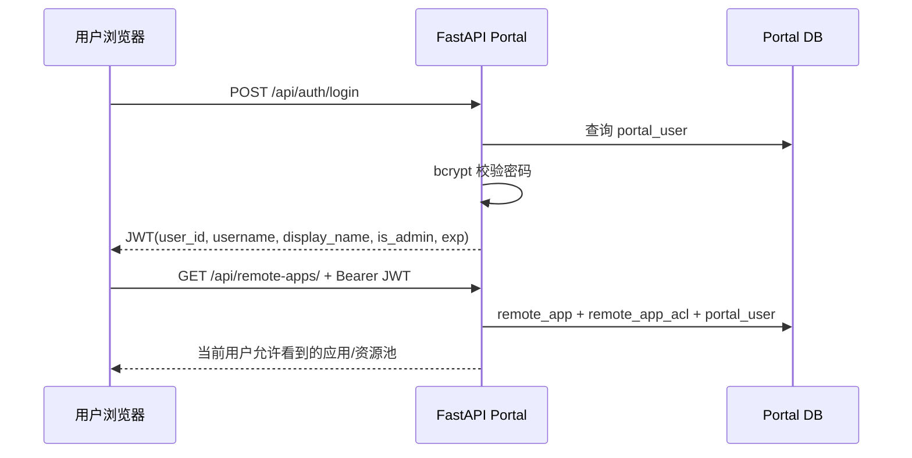
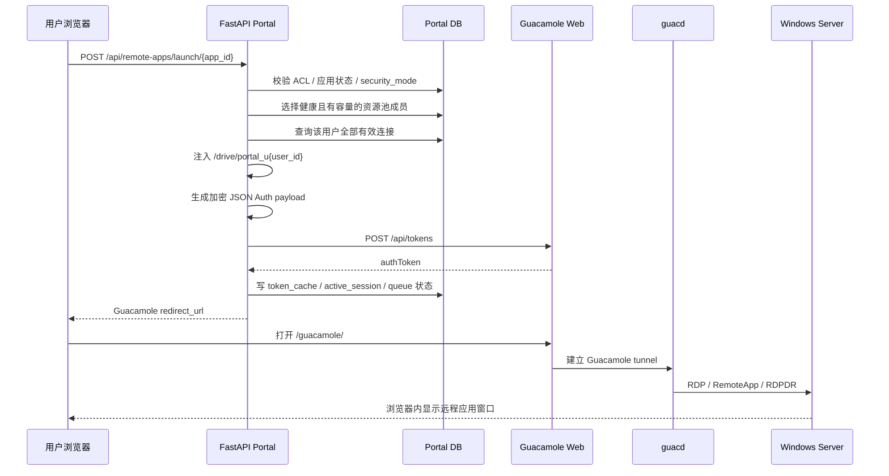
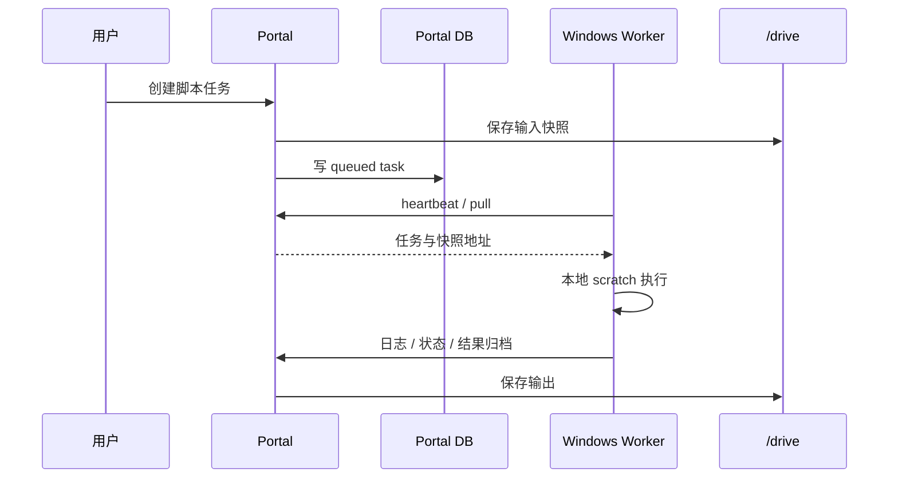
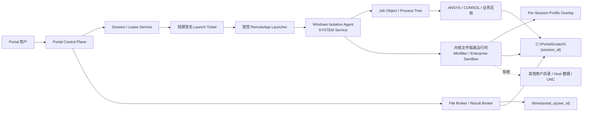

# Guacamole RemoteApp Portal

> 文档定位：项目总览、真实技术架构、核心事件流程、用户文件隔离机制、Windows RemoteApp 主机配置和新服务器标准流程。
> 当前架构快照：2026-07-26。生产 Portal 的详细部署参数见 [`deploy/readme.md`](deploy/readme.md)，Windows 一般限制的执行与验收细节见 [`docs/2026-07-26-guacdrive-general-restriction-runbook.md`](docs/2026-07-26-guacdrive-general-restriction-runbook.md)。

## 1. 项目是什么

本项目是 Apache Guacamole 前置的 FastAPI RemoteApp 门户。用户不直接操作 Guacamole 的登录页、连接树和管理界面，而是：

1. 登录 Portal。
2. 根据 Portal ACL 查看允许使用的软件。
3. 点击应用卡片。
4. Portal 按容量、健康状态和并发规则选择 Windows 运行实例。
5. Portal 创建或复用当前用户的 Guacamole JSON Auth token。
6. 浏览器进入 Guacamole RemoteApp 会话。
7. Windows 只显示被发布的应用窗口，而不是默认提供完整桌面。

系统目前同时包含两个执行平面：

- **GUI RemoteApp 平面**：Guacamole + guacd + Windows RDP/RemoteApp 主机。
- **脚本任务平面（可选）**：Portal 任务队列 + 独立 Windows Worker 节点。

GUI RemoteApp 启动不依赖 Worker；Worker 只处理脚本任务、输入快照和结果回传。

## 2. 当前安全目标与边界

当前目标是 **一般访问限制**：

- 普通用户正常使用时只通过个人 `GuacDrive` 读写业务文件。
- 普通业务连接只发布指定 RemoteApp。
- 完整桌面和管理工具进入管理员连接域。
- 关闭普通业务 RemoteApp 的剪贴板、浏览器上传/下载、打印和麦克风等旁路通道。
- Windows 侧通过标准用户、入口策略、NTFS、AppLocker、Firewall 和会话清理降低常见绕过风险。

当前方案不是恶意代码不可突破的多租户硬隔离，原因是普通用户仍可能共享同一个 Windows 账号：

- 共享相同 Windows SID 和 access token。
- 共享 HKCU、用户 profile、Temp、Recent、部分应用缓存和 Windows 审计身份。
- GuacDrive 隔离不等于 Windows 本地盘权限隔离。
- 驱动器隐藏、禁用 Explorer 等入口不等于应用文件 API 失效。

需要严格文件授权或运行不可信代码时，应建立新的强制安全边界：

- 每个用户使用独立 Windows 账号/SID，并使用 NTFS ACL；或
- 每租户独占 VM、主机或 Worker；或
- 在共享 Windows 账号不变的条件下，增加按 Portal session/process tree 执行的内核文件隔离运行时、Windows Isolation Agent 和 File Broker。

第三种是第 11 章确定的目标生产架构，当前尚未实现；在隔离运行时和验收矩阵完成前，现有系统仍只能称为一般访问限制。

## 3. 技术栈

| 层次 | 当前技术 |
|---|---|
| Portal 后端 | Python 3.11、FastAPI、Pydantic、mysql-connector-python |
| Portal 前端 | Vue 3、TypeScript、Pinia、Vite、Vitest |
| 认证 | Portal JWT、bcrypt；Guacamole JSON Authentication |
| RemoteApp 协议 | Apache Guacamole、guacd、RDP、RAIL/RemoteApp、RDPDR drive redirection |
| 数据库 | MySQL 8，包含 Guacamole 库和 Portal 业务库 |
| 入口与文件下载 | Nginx、WebSocket 反向代理、`X-Accel-Redirect` |
| 部署 | Docker Compose；生产推荐 Linux Docker Engine |
| Windows 主机策略 | 本地账号/组、用户策略、NTFS、AppLocker、Windows Firewall、Scheduled Task |
| 可选任务执行 | Windows Worker、快照、队列、心跳、结果归档 |

权威完整部署入口是：

```text
deploy/docker-compose.yml
```

仓库根目录旧 `docker-compose.yml` 是较早的 Guacamole-only 栈，不用于当前完整 Portal 部署。

## 4. 总体架构



`/drive` 的实际挂载关系：

- `portal-backend`：读写，用于文件 API、配额和任务快照。
- `guacd`：读写，将指定目录通过 RDPDR 映射到 Windows 会话。
- `nginx`：只读，用于 `X-Accel-Redirect` 下载。
- `guac-web`：不直接挂载 `/drive`。

### 4.1 组件职责与代码入口

| 组件 | 职责 | 关键入口 |
|---|---|---|
| Nginx | `/api`、`/guacamole/`、WebSocket、上传和内部文件下载 | `deploy/nginx/conf.d/portal.conf` |
| FastAPI 装配 | 注册认证、应用、资源池、监控、文件、任务和 Worker 路由；启动清理/探测循环 | `backend/app.py` |
| Portal 认证 | bcrypt 登录、JWT 签发、Bearer 校验、管理员守卫 | `backend/auth.py` |
| RemoteApp 启动 | ACL、安全模式、资源池选择、Guacamole 连接构建、会话记录 | `backend/router.py` |
| Guacamole 加密 | JSON Auth payload、HMAC、AES、RDP/RemoteApp 参数映射 | `backend/guacamole_crypto.py` |
| Guacamole 服务 | token 创建、验证、双层缓存、重定向 URL | `backend/guacamole_service.py` |
| 资源池/队列 | 容量、健康探测、成员选择、并发限制、排队 | `backend/resource_pool_service.py` |
| 文件空间 | 配额、目录、断点上传、下载 token、删除和移动 | `backend/file_router.py` |
| VSCode 策略 | 权限目录、白名单、固定 profile 路径和启动参数 | `backend/vscode_policy_service.py` |
| Worker 平面 | 注册、心跳、拉取任务、日志和结果归档 | `backend/worker_router.py`、`backend/worker_service.py` |

### 4.2 稳定 API 前缀

```text
/api/auth
/api/remote-apps
/api/admin
/api/monitor
/api/admin/monitor
/api/files
/api/datasets
/api/tasks
/api/worker
/guacamole/
/internal-drive/
```

不要随意修改这些前缀，现有 Vue、旧静态页面、Nginx 和 Worker 都依赖它们。

## 5. 三类地址必须分清

| 地址 | 示例 | 用途 |
|---|---|---|
| Portal 外部地址 | `https://portal.example.com` | 浏览器和 Worker 访问 |
| 容器内部 Guacamole 地址 | `http://guac-web:8080/guacamole` | Portal backend 创建/验证 token |
| Windows RemoteApp 主机地址 | `192.168.56.6:3389` | guacd 最终建立 RDP 会话 |

关键规则：

- `PORTAL_HOST` 不是 RDP 主机地址。
- Windows 地址来自数据库 `remote_app.hostname` 和 `remote_app.port`。
- 外部入口与 Docker 监听地址不同的时候，必须设置 `PORTAL_PUBLIC_HOST` / `PORTAL_PUBLIC_PORT`。
- Portal 会尽量根据 `Host`、`X-Forwarded-Proto` 等请求头重建浏览器可访问的 Guacamole URL，不能在代码中硬编码 localhost。

## 6. 核心事件流程

### 6.1 登录与应用列表



普通用户在查询和 ACL 更新阶段都会过滤 `admin_desktop`，不是只在前端隐藏卡片。

### 6.2 RemoteApp 启动



Portal 使用 Guacamole JSON Authentication 约定生成 token payload：

```text
username + expires + connections
  → JSON
  → HMAC-SHA256 签名
  → sign + data
  → PKCS7 padding
  → AES-128-CBC（Guacamole JSON Auth 约定的零 IV）
  → Base64
  → POST /guacamole/api/tokens
```

### 6.3 为什么一个 Portal 用户复用一个 Guacamole token

Portal 会把该用户可访问的全部连接放入同一个 JSON Auth payload，并按 Portal 用户缓存 token：

```text
内存缓存
  ↓ miss
token_cache 表
  ↓ miss/过期/无效
重新 POST /api/tokens
```

这是为了避免 Guacamole 在浏览器 localStorage 中保存新 token 时，把旧标签页正在使用的 token 覆盖掉。

应用、ACL、VSCode 策略或连接参数发生变化后必须：

1. 调用 `invalidate_all_sessions()` 或清空对应 token cache。
2. 确认运行中的 backend 内存缓存也被清理；必要时重启 `portal-backend`。
3. 结束旧 Windows 会话后重新启动。
4. 以 Windows `Win32_Process.CommandLine` 核对最终参数，不能只看数据库。

### 6.4 文件上传和下载

上传流程：

```text
Browser
  → Nginx upload streaming
  → FastAPI upload/init
  → 分片 upload/chunk
  → 校验 offset / 大小 / 配额
  → 完成后原子移动到 /drive/portal_u{user_id}
```

下载流程：

```text
Browser
  → FastAPI 申请短期 download token
  → FastAPI 校验用户、路径和 token
  → 返回 X-Accel-Redirect
  → Nginx 从 /internal-drive/ 对应 /drive 文件发送
```

FastAPI 不直接流式发送业务文件，避免大文件长期占用 Python worker。

### 6.5 可选 Worker 任务流程



Worker 是独立 Windows 节点，不是 Guacamole RemoteApp 会话。

### 6.6 后台控制循环

FastAPI 进程还持续执行：

- stale/idle Portal session 清理与回收；
- Windows 运行实例 TCP 健康探测；
- launch queue 调度；
- Worker offline/stalled 状态协调；
- 过期断点上传清理。

这些循环维护的是 Portal 控制面状态。TCP 3389 healthy 只说明网络端口可达，不代表 Windows 凭据、RemoteApp alias、应用进程和第三方许可证都正常。

## 7. 数据模型

| 表 | 用途 |
|---|---|
| `portal_user` | Portal 用户、管理员标识、配额 |
| `remote_app` | RDP 主机、Windows 凭据、RemoteApp alias/目录/参数、安全模式和通道参数 |
| `remote_app_acl` | Portal 用户可以访问哪些应用 |
| `vscode_control_profile` | VSCode 权限、shell/工具/调试器/扩展/网络白名单 |
| `resource_pool` | 逻辑资源池、总并发和队列策略 |
| `resource_pool_member` | 资源池成员与应用运行实例 |
| `remote_app_health` | TCP 健康探测、失败原因和 cooldown |
| `token_cache` | Portal 用户对应的 Guacamole token 缓存 |
| `active_session` | Portal 逻辑会话、心跳和回收状态 |
| `launch_queue` | 资源不足时的启动排队 |
| `audit_log` | 登录、启动、策略阻断、文件操作等审计 |
| Worker/Task 相关表 | Worker 注册、心跳、任务、输入/输出和状态流转 |

`active_session` 表示 Portal/浏览器逻辑会话，不等于 Windows 上某个软件进程或第三方许可证已经实际占用。

## 8. 用户文件隔离是如何实现的

### 8.1 每用户目录

Portal 根据 JWT 中的 `user_id` 固定生成：

```text
/drive/portal_u{user_id}
```

例如：

```text
Portal 用户 2 → /drive/portal_u2
Portal 用户 3 → /drive/portal_u3
```

guacd 只把当前 Portal 用户的目录映射给本次连接。共享名按数据库中的 `display_name` 动态生成，空值回退 `username`：

```text
Portal 用户张三 → \\tsclient\张三 的资料空间
Portal 用户李四 → \\tsclient\李四 的资料空间
```

两个用户看到不同共享名，背后仍分别对应自己的 Linux/Docker 目录。

`drive-name` 同时决定 `\\tsclient` 下的共享名和 Windows“此电脑”条目中的文件系统名称。Windows 会把它与 RDP `client-name` 组合，因此“此电脑”通常显示为“Guacamole RDP 上的 张三 的资料空间”；Guacamole 1.6 没有受支持的参数可隐藏这个系统前缀。

### 8.2 RemoteApp 默认工作目录

- 新建应用把 `remote_app_dir` 留空，避免把共享应用绑定到某个固定用户名。
- 启动时由 `backend/router.py` 动态展开为 `\\tsclient\{display_name 或 username} 的资料空间`。
- 历史固定值 `\\tsclient\GuacDrive` 和 `\\tsclient\用户数据目录` 也按动态路径处理；显式配置的应用专用目录继续保留。
- 每个 Portal 用户的 guacd `drive-path` 仍固定指向各自 `/drive/portal_u{user_id}`。
- Guacamole 的 `remote-app-dir` 只定义 RemoteApp 进程的启动工作目录。第三方软件可以忽略当前目录，Windows/应用自己的“打开/另存为”对话框也可能记忆其他位置；需要强制文件对话框或打开特定文件时，应使用应用参数或受控 Launcher，而不是把 `remote-app-dir` 当成硬限制。

### 8.3 隔离层次

| 层次 | 技术手段 | 当前作用 | 是否构成 Windows 硬隔离 |
|---|---|---|---|
| Portal 身份 | JWT 中的 `user_id` | 确定用户和个人目录 | 否 |
| Portal ACL | `remote_app_acl` | 控制用户可见和可启动的应用 | 否 |
| 文件 API | `_safe_resolve()`、路径规范化、Windows 文件名校验 | 阻止 `..`、绝对路径和越出个人目录 | 仅保护 Portal API |
| 存储目录 | `/drive/portal_u{user_id}` | 每个 Portal 用户独立目录 | 保护 Linux/Portal 侧路径 |
| Guacamole token | 每用户连接集合和 token | 防止拿到未授权连接 | 否 |
| RDPDR | guacd `drive-path` + 动态 `drive-name` | 只映射当前用户，并显示为“用户名 的资料空间” | 否 |
| 通道控制 | 禁剪贴板、浏览器传输、打印、音频输入 | 减少文件旁路和数据通道 | 否 |
| Windows 入口限制 | NoDrives、NoViewOnDrive、禁 Run/控制面板/任务管理器等 | 阻止常规 UI 入口 | 否 |
| Windows 身份 | 标准账号、管理员账号分域 | 限制系统权限 | 共享账号时不是租户隔离 |
| NTFS ACL | 限制 profile、数据目录、管理目录 | Windows 文件授权的核心 | 使用独立 SID 时才是强边界 |
| AppLocker | EXE/Script/MSI Enforced、DLL Audit | 阻止常用逃逸工具和未批准程序 | 程序控制，不是文件 ACL |
| Firewall | SMB/WebDAV/非必要出口限制 | 阻止网络共享和外部通道 | 网络边界 |
| 会话清理 | Scheduled Task 清理 Temp/Recent/缓存 | 减少共享账号残留 | 事后清理，不是实时授权 |

### 8.4 Portal API 隔离和 Windows 会话隔离不是一回事

Portal 文件 API 会把所有路径限制在当前用户目录内，这个边界只对：

```text
/api/files/*
```

有效。

Windows RemoteApp 进程不经过 Portal 文件 API。允许的 Windows 应用仍可能通过：

- 文件打开对话框；
- 绝对路径；
- APPDATA/TEMP/ProgramData；
- 插件、宏、脚本和子进程；
- 本地或网络文件 API；

访问共享 Windows 账号有权读取的其他位置。

因此当前描述必须使用：

```text
一般限制 / 正常流程只使用个人 GuacDrive
```

不能使用：

```text
硬隔离 / 任何情况下只能访问 GuacDrive
```

## 9. 三种连接安全模式

| 模式 | 使用者 | 行为 |
|---|---|---|
| `restricted_remoteapp` | 普通业务应用 | RemoteApp 必须非空；强制关闭双向剪贴板、浏览器上传/下载、打印和音频输入 |
| `restricted_vscode` | 受控开发环境 | 动态资料空间工作区和每 Portal 用户独立 profile/extensions，权限由 `vscode_control_profile` 计算 |
| `admin_desktop` | 管理员 | 允许完整桌面；普通用户查询和 ACL 更新均拒绝 |

VSCode 当前生成的核心参数类似：

```text
--user-data-dir="C:\PortalProfiles\{user_id}"
--extensions-dir="C:\PortalExtensions\{user_id}"
--disable-gpu
--disable-workspace-trust
"\\tsclient\张三 的资料空间"
```

Windows 主机还要为对应 Portal 用户写入：

```json
{
  "security.allowedUNCHosts": ["tsclient"],
  "security.restrictUNCAccess": true
}
```

否则 VSCode 会因为 UNC host 或 Workspace Trust 提示阻断正常启动。

## 10. 当前 Windows Server 试点配置

以下为 2026-07-26 的实际试点快照，不代表正式生产完成状态。

### 10.1 主机与管理

| 项目 | 当前值 |
|---|---|
| 主机名 | `WIN-UGUPI2FHM86` |
| 操作系统 | Windows Server 2019 Standard |
| 地址 | `192.168.56.6/24` |
| 网关 | `192.168.56.2` |
| RDP | TCP 3389、NLA、drive redirection 开启 |
| WinRM | HTTPS 5986 已配置；HTTP 5985 仍存在于试点基线 |
| 管理方式 | 管理员账号与普通 RemoteApp 账号分离 |

凭据没有写入仓库、README、日志或 Git 提交。

### 10.2 Windows 账号与应用域

| 账号/组 | 用途 |
|---|---|
| 管理员账号 | 带外管理、完整桌面、策略恢复 |
| `GuacRemoteApp` | 记事本、计算器等严格普通 RemoteApp |
| `GuacVscode` | VSCode 受控开发连接 |
| `GuacRestrictedRemoteApp` | 普通 RemoteApp AppLocker/策略组 |
| `GuacRestrictedVscode` | VSCode AppLocker/策略组 |

两个普通账号：

- 不是 Administrators 成员。
- 加入 Remote Desktop Users。
- 与管理员桌面账号分开。
- 当前仍是供多个 Portal 用户复用的共享 Windows 账号。

已发布 RemoteApp：

```text
记事本
Windows Calculator
Visual Studio Code
Google Chrome（已发布但普通安全域不应默认授权）
```

### 10.3 RDP 和 RemoteApp

当前关键值：

```text
fDenyTSConnections=0
fSingleSessionPerUser=0
RDP-Tcp PortNumber=3389
UserAuthentication=1
SecurityLayer=2
fDisableCdm=0
```

含义：

- 允许 RDP。
- 同一个共享 Windows 账号可以建立多个会话。
- 启用 NLA。
- 保留 RDP drive redirection，这是 GuacDrive 能出现的前提。

### 10.4 用户入口策略

普通账号 profile 中已应用的主要限制包括：

- 隐藏/限制 C、D 等本地盘入口。
- 禁用 Run、控制面板、任务管理器、注册表工具等常规入口。
- 限制网络驱动器映射入口。
- `GuacRemoteApp` 禁用 cmd；`GuacVscode` 保留受控终端能力。
- Desktop、Documents、Downloads 指向或限制到当前用户 `\\tsclient\用户名 的资料空间` 的正常工作流。
- 保护关键策略注册表键，普通账号只能读取。

这些策略主要控制 Explorer 和公共 UI，不替代 NTFS ACL。

### 10.5 NTFS 与目录

当前建立的核心目录：

```text
C:\Apps
C:\PortalProfiles
C:\PortalExtensions
C:\ProgramData\GuacDriveRestriction
```

当前权限原则：

- `C:\Apps` 对普通应用组保留 Read & Execute。
- `C:\PortalProfiles`、`C:\PortalExtensions` 给 VSCode 组必要的修改权限。
- 普通账号保持标准用户权限。
- 不对整个 `C:\` 设置递归粗暴 Deny，以免破坏 Windows 和应用加载。

当前 NTFS 规则仍属于试点基线，其他 profile、业务数据卷、备份目录和第三方软件专属目录还需要逐项验收。

### 10.6 AppLocker

当前状态：

| Collection | 模式 |
|---|---|
| EXE | Enforced |
| Script | Enforced |
| MSI | Enforced |
| DLL | AuditOnly |

普通 RemoteApp 组显式阻止的典型入口：

```text
explorer.exe
cmd.exe
powershell.exe
wscript.exe / cscript.exe
mshta.exe
mmc.exe
taskmgr.exe
control.exe
reg.exe / regedit.exe
rundll32.exe
msiexec.exe
schtasks.exe
sc.exe
net.exe
certutil.exe
bitsadmin.exe
curl.exe / ftp.exe / tftp.exe
wmic.exe
```

还限制浏览器、Node、Python、Git、Sandboxie、VNC 等当前试点不允许的通用执行入口。

实际负向测试已产生 AppLocker 8004 阻断事件：

- `GuacRemoteApp` 启动 `cmd.exe` 被阻止。
- `GuacVscode` 启动 `explorer.exe` 被阻止。

允许的记事本、计算器和 VSCode 在 Enforced 下仍能启动。

### 10.7 Firewall 和网络

当前试点：

- 三个 Firewall profile 均启用。
- 默认入站为 Block。
- 仅管理网段放行 RDP 3389、WinRM HTTPS 5986；试点仍保留 HTTP 5985。
- 阻断 SMB TCP 139/445 和 NetBIOS UDP 137/138 出站。
- WebClient/WebDAV 服务被停用。
- 默认出站仍是 Allow。

因此当前只完成 SMB/WebDAV 基础阻断，许可证、数据库、Git、包仓库、AI/MCP 和业务服务的精确 HOST/PORT allowlist 尚未收口。

### 10.8 VSCode 企业策略和独立 profile

当前主机已配置：

- `AllowedExtensions`：默认拒绝未登记扩展，只允许试点批准项。
- `UpdateMode=none`：避免共享主机上的自动更新改变二进制和 AppLocker 依赖。
- Portal 用户 1、2、3 分别初始化独立的 `C:\PortalProfiles\ID`。
- Portal 用户 2、3 已真实并发验证：user-data 和 extensions 目录不同，各自只看到个人 GuacDrive。

新增 Portal 用户后必须执行：

```powershell
powershell -File scripts\windows\set-vscode-guacdrive-profile-settings.ps1 `
  -PortalUserIds USER_ID `
  -DiscoverExistingProfiles
```

### 10.9 会话清理

当前注册了 SYSTEM Scheduled Task：

```text
GuacDrive Restricted Profile Cleanup
```

触发：

- 系统启动。
- 每 15 分钟。

无对应 Windows 会话时清理：

- Desktop、Documents、Downloads。
- `%LOCALAPPDATA%\Temp`。
- Recent。
- VSCode Cache、CachedData、Code Cache、GPUCache、logs、Service Worker CacheStorage、workspaceStorage。

清理是降低共享账号残留的补充措施，不能代替独立 SID/NTFS ACL。

### 10.10 当前已验证结果

- Portal、MySQL、Guacamole、guacd、Nginx 容器健康。
- 普通用户看不到 `admin_desktop`。
- 记事本和计算器 RemoteApp 正常。
- GuacDrive 中的文件可以打开、修改和保存。
- Portal 用户 A/B 的 GuacDrive 内容互不可见。
- VSCode A/B 同时运行，最终命令行使用独立 profile/extensions 路径。
- AppLocker Enforced 下允许程序正常，`cmd.exe` / `explorer.exe` 被阻止。
- Windows 试点检查脚本通过，RDS 缺失作为 warning 保留。

### 10.11 当前未完成和高风险项

- 未安装正式 `RDS-RD-Server` / RDS Session Host。
- 当前 `TermService\Parameters\ServiceDll` 指向 RDP Wrapper。
- 未配置正式 RDS Licensing Server / CAL。
- Defender 被本地策略关闭。
- 存在待安装的 Windows Server 2019、.NET 累积更新和恶意软件删除工具。
- Windows 更新可能改变 `termsrv.dll` 并使 RDP Wrapper 失效。
- 出站网络仍不是精确 allowlist。
- DLL AppLocker 仍是 AuditOnly。
- 未完成真实 ANSYS、COMSOL 等仿真软件的子进程、临时目录、恢复目录和许可证依赖验收。

正式上线顺序应是：

```text
VM 快照
→ 正式 RDS Session Host + Licensing/CAL
→ 移除 RDP Wrapper
→ 恢复 Defender
→ 安装 Windows 更新
→ 重新验证 RemoteApp/AppLocker/GuacDrive
```

## 11. 生产多会话共享账号下的严格文件隔离架构

> 本章是**目标生产架构和实施要求**，不是当前已经具备的能力。

### 11.1 固定业务前提

后续新增 Windows RemoteApp 服务器固定采用以下背景：

1. Windows Server 已具备正式的多会话并发能力。
2. 用于生产环境。
3. 普通 Portal 用户继续复用同一个低权限 Windows 账号。
4. 业务要求严格文件隔离：用户 A 不能读取、修改、删除或枚举用户 B 的输入、工作文件、中间文件和输出。

必须先接受一个事实：

```text
多会话能力 ≠ 多租户文件隔离
共享 Windows 账号 ≠ 不同 Windows 安全主体
```

多个 RDS Session ID 可以隔离窗口、桌面和部分进程上下文，但共享账号意味着所有会话仍使用相同 Windows SID/access token。仅依赖以下机制不能满足严格文件隔离：

- `/drive/portal_u{user_id}` 和动态 `\\tsclient\用户名 的资料空间`；
- RDP/RAIL/RemoteApp 会话；
- 隐藏盘符、禁 Explorer、禁 Run；
- 关闭剪贴板、浏览器上传/下载、打印；
- AppLocker、Firewall 和事后清理；
- 不同的 VSCode profile 目录；
- 不同的 Sandboxie box 名称。

这些机制可以降低误操作和常见绕过，但不会把同一个 Windows SID 变成不同用户的 NTFS 权限主体。

### 11.2 架构决策

在“共享 Windows 账号”不改变的前提下，要满足严格文件隔离，必须新增一个**按 Portal 会话强制执行的文件系统安全边界**。

本项目的目标方案确定为：

```text
Portal Session/Lease Service
 Windows Isolation Agent（SYSTEM 服务）
 受控 RemoteApp Launcher
 Job Object / Process Tree
 经安全评审和签名的内核文件隔离运行时
 File Broker / Result Broker
 每会话 overlay、profile 和 local scratch
```

其中真正承担文件拒绝职责的是：

- 经验证的内核文件系统 minifilter；或
- 具备等效内核强制能力、可以按 Session/Process Context 隔离读写的企业应用沙箱。

Sandboxie-Plus 可以用于 PoC、兼容性验证和降低配置污染，但默认不把它认定为生产严格隔离边界：

- 它不创建新的 Windows SID。
- `LockBoxToUser` 看到的是共享 Windows 用户，不是 Portal 用户。
- 许可证服务、GPU、COM、插件等兼容例外会扩大穿透面。
- 未完成跨 box、子进程、服务、IPC 和宿主路径逃逸测试前，不能写成“严格隔离已完成”。

如果找不到经过安全评审、可支持目标第三方软件的内核隔离运行时，则生产兜底方案必须改为：

- 每 Portal 用户/会话独占 Hyper-V VM、独占 Worker 或独立 Windows 主机；或
- 改为不同 Windows SID/账号。

否则“共享账号”和“严格文件隔离”两个要求不能同时验收通过。

### 11.3 严格文件隔离的验收定义

本章中的严格文件隔离至少覆盖：

- 用户 A 不能读取、覆盖、删除、重命名或枚举用户 B 的业务文件。
- 用户 A 不能读取用户 B 的 scratch、Temp、恢复文件、日志和缓存。
- 主应用及其子进程、插件、宏和脚本均受相同文件策略约束。
- 绝对路径、UNC、设备路径、符号链接、junction、hard link 和重解析点不能绕过隔离。
- 会话崩溃、网络断开、guacd 重启和应用异常退出后，不留下其他用户可读数据。
- 文件授权以 Portal 用户和 session lease 为依据，而不是共享 Windows 用户名。

它不自动等于完整恶意代码隔离。以下威胁仍需要 VM/Hypervisor、补丁、Defender/EDR、网络分区和管理员安全共同处理：

- Windows 内核或驱动漏洞；
- 本地提权；
- 管理员凭据泄露；
- 跨进程注入、IPC/共享内存和侧信道；
- 隔离驱动或 Agent 自身漏洞；
- 宿主机整体失陷。

### 11.4 目标架构



共享 Windows 账号只承担 RDS 登录和 GUI 会话承载，不再作为业务文件授权主体。

### 11.5 组件与信任边界

| 组件 | 运行身份 | 职责 | 当前是否存在 |
|---|---|---|---|
| Portal Control Plane | Portal service | JWT、ACL、应用策略、用户身份 | 已存在 |
| Session/Lease Service | Portal service | 为每次启动生成唯一隔离租约、TTL、fencing | 未实现 |
| Launch Ticket | 短期 capability | 将 Portal user/session/app 与 Windows 启动绑定 | 未实现 |
| RemoteApp Launcher | 共享低权限账号启动，受 Agent 控制 | 不直接启动第三方 EXE；只提交 ticket | 未实现 |
| Windows Isolation Agent | LocalSystem | 验证 ticket、创建隔离上下文、启动/终止进程树 | 未实现 |
| 内核文件隔离运行时 | 签名驱动/受信产品 | 按 isolation context 强制允许、重定向或拒绝文件 I/O | 未实现 |
| Job Object | Agent 管理 | 绑定主进程、子进程、资源限制和整体终止 | 未实现 |
| File Broker | 受信服务 | 按 Portal user capability 读取输入、写入结果 | 未实现 |
| Per-session overlay | 隔离运行时管理 | 虚拟化 APPDATA、LOCALAPPDATA、TEMP、Recent 等 | 未实现 |
| Local scratch | Windows 本地 NTFS | 复杂应用高速计算和中间文件 | 需标准化 |
| GuacDrive | guacd/RDPDR | 当前用户文件交换和结果入口 | 已存在 |
| AppLocker/Firewall | Windows policy | 程序和网络控制，作为纵深防御 | 部分已存在 |

“当前是否存在”必须保留，避免把目标设计误写成现有能力。

### 11.6 Session Lease 与 Windows 进程绑定

现有 `active_session` 主要记录 Portal/浏览器逻辑会话和心跳，没有以下强隔离字段：

```text
lease_token
lease_expires_at
fencing_token / generation
windows_session_id
isolation_context_id
root_pid
process_tree_state
scratch_path
policy_version
result_manifest_state
```

目标启动流程：

1. Portal 校验 JWT、ACL、应用、资源池、许可证和隔离策略版本。
2. 数据库事务原子创建 `session_lease`。
3. 生成一次性、短期、不可预测的 launch ticket。
4. Guacamole RemoteApp alias 固定启动 `PortalAppLauncher.exe`，不直接启动第三方软件。
5. Launcher 将 ticket 交给本机 Isolation Agent。
6. Agent 向 Portal 验证 ticket，获取 `user_id`、`session_id`、应用 manifest 和文件 capability。
7. Agent 获取真实 Windows RDS Session ID。
8. Agent 创建 isolation context、profile overlay、scratch 和 Job Object。
9. Agent 在隔离上下文中启动第三方主 EXE，并跟踪完整子进程树。
10. Agent/Portal 心跳续租；租约过期或 fencing 变化时立即停止进程树。

建议状态机：

```text
requested
  → leased
  → preparing
  → starting
  → running
  → collecting
  → syncing
  → completed

任意阶段可进入：
revoked / expired / failed / cleanup_pending
```

旧 Agent、旧进程或旧会话不得在新 generation 建立后继续写文件。

### 11.7 文件命名空间和强制策略

每个 isolation context 只允许以下路径类别：

| 路径类别 | 权限 | 说明 |
|---|---|---|
| Windows/Program Files 必需文件 | Read/Execute allowlist | 只允许应用运行依赖，不允许写 |
| 当前会话 profile overlay | Read/Write | APPDATA、LOCALAPPDATA、TEMP、Recent、应用配置 |
| `C:\PortalScratch\{session_id}` | Read/Write | 当前会话计算和中间文件 |
| 当前 Portal 用户输入 | Broker-controlled Read | 启动前按 manifest staging |
| 当前 Portal 用户输出 | Broker-controlled Write | 结束时按输出规则同步 |
| 当前会话 `\\tsclient\用户名 的资料空间` | 按应用策略 | 简单应用可直接使用；复杂应用优先 broker staging |
| 其他用户 scratch/profile | Deny | 即使共享 SID 也由隔离运行时拒绝 |
| `C:\Users` 真实共享 profile | 默认 Deny/Redirect | 必需文件重定向到 overlay |
| 未登记 ProgramData/数据卷 | Deny | 逐应用增加只读或可写能力 |
| 任意 UNC/SMB/WebDAV | Deny | 许可证等例外由 manifest 单独声明 |
| `\\?\`、`\\.\`、设备路径 | Deny | 防止绕过 Win32 路径规范化 |
| junction/symlink/reparse point | Resolve then authorize | 以最终真实对象重新授权 |

隔离检查必须发生在内核或等效强制层。仅在 Launcher 中检查字符串没有意义，第三方进程可以直接调用 `CreateFile`。

### 11.8 Profile、注册表和临时目录

共享账号默认共享 HKCU 和 Windows profile。仅隔离业务目录仍可能通过以下位置泄漏数据：

```text
%APPDATA%
%LOCALAPPDATA%
%TEMP%
Recent
CrashDumps
应用恢复目录
插件缓存
许可证缓存
```

生产隔离运行时必须为每个 isolation context 提供：

- 文件 profile overlay；
- 注册表/HKCU 虚拟化或按会话隔离；
- Known Folder 重定向；
- 独立 TEMP、恢复、日志和崩溃目录；
- 子进程继承相同 overlay；
- 会话结束后的完整销毁。

如果目标产品不能隔离注册表、Known Folder 和子进程，则不能通过生产验收。

### 11.9 File Broker 和数据流

严格模式下，权威业务文件流为：

```text
/drive/portal_u{user_id}
  → File Broker 校验 capability、路径、大小和 hash
  → staging 到 C:\PortalScratch\{session_id}\input
  → 隔离应用在 scratch 内工作
  → 输出进入 C:\PortalScratch\{session_id}\output
  → Result Broker 校验 manifest、hash、大小和类型
  → 幂等同步回 /drive/portal_u{user_id}
```

File Broker 必须：

- 只接受 Portal 颁发的短期 capability。
- capability 固定 `user_id + session_id + app_id + allowed operation`。
- 规范化路径并重新解析最终对象。
- 拒绝绝对 Windows 路径、UNC、设备名、ADS、junction、symlink 和越权 user ID。
- 防止 TOCTOU：校验和打开尽量在同一受控操作中完成。
- 限制文件数量、单文件大小、总大小、解压倍率和并发。
- 保存 manifest、SHA-256、来源、目标、操作人和 session 审计。
- 输出同步具有幂等键，断线重试不能产生重复或覆盖错误版本。

RemoteApp 直接操作动态 `\\tsclient\用户名 的资料空间` 会绕过 Portal 文件 API 的配额和审计。严格模式下应优先使用 Broker staging；需要直接 GuacDrive 的简单应用必须单独登记并经过隔离运行时验证。

### 11.10 Local scratch 生命周期

推荐目录：

```text
C:\PortalScratch\{session_id}\input
C:\PortalScratch\{session_id}\work
C:\PortalScratch\{session_id}\output
C:\PortalScratch\{session_id}\logs
```

生命周期：

1. Agent 验证 lease 后创建目录。
2. 写入不可变 session metadata 和 policy version。
3. Broker staging 输入。
4. 运行期间持续检查配额、磁盘和 lease。
5. 应用结束后停止新的文件写入。
6. 生成结果 manifest 和 hash。
7. 同步并验证 Portal 端结果。
8. 终止完整进程树。
9. 卸载 overlay、撤销 isolation context。
10. 安全删除 scratch；失败时进入 quarantine 而不是交给下一个用户。

仅按顶层 RemoteApp 窗口关闭判断会话结束是不够的，ANSYS、COMSOL、MPI、求解器和插件可能仍有子进程运行。

### 11.11 AppLocker、WDAC 和 Firewall

这些策略是纵深防御，不替代内核文件隔离。

应用 manifest 必须列出：

- 主 EXE；
- launcher/helper；
- 求解器和 MPI 子进程；
- 插件宿主；
- 脚本解释器；
- 调试器和工具链；
- 服务和许可证客户端；
- DLL、驱动和 COM 依赖。

策略顺序：

```text
Audit
→ 收集真实进程/DLL/脚本/网络证据
→ 评审 allowlist
→ Enforced
→ 真实双用户回归
```

Firewall：

- 默认入站 Block。
- 普通应用进程默认禁止 SMB、WebDAV、管理员共享和任意外网。
- 按应用 manifest 放行许可证 `HOST:PORT`、数据库和必要业务服务。
- 最终目标是出站 Block + 精确 allowlist。
- Agent、Broker 和 Portal 使用独立服务身份和专用端口。
- 所有拒绝和例外写入审计。

### 11.12 第三方应用接入合同

每个新增应用必须提交 manifest，而不是只填一个 EXE：

```yaml
app_id: APP_ID
remote_app_alias: REMOTE_APP_ALIAS
main_executable: MAIN_EXE
arguments_template: ARGUMENTS_TEMPLATE
working_directory: SESSION_WORK_DIR
profile_paths: []
temp_paths: []
recovery_paths: []
child_processes: []
plugins: []
script_engines: []
license_endpoints: []
network_allowlist: []
input_patterns: []
output_patterns: []
max_scratch_bytes: SIZE
cleanup_policy: POLICY
policy_version: VERSION
```

ANSYS、COMSOL 等复杂软件至少验收：

- 项目目录和关联文件；
- solver/MPI 子进程；
- 本地高速 scratch；
- TEMP、恢复和崩溃文件；
- 插件、宏、Journal 和脚本引擎；
- 许可证服务及端口；
- 中断、恢复和结果同步。

没有完整 manifest、进程树和文件/网络证据时，应用保持不可绑定或不可启动。

### 11.13 新服务器配置顺序

新服务器已经支持多会话，但仍要验证它是正式生产能力：

#### A. 生产前置

1. 确认正式 RDS Session Host、Licensing Server 和 CAL 正常。
2. 确认没有使用 RDP Wrapper 替代正式 RDS。
3. 创建 VM snapshot 和带外管理员入口。
4. 安装 Windows 更新，启用 Defender/EDR。
5. 配置 WinRM HTTPS 和管理网段 Firewall。
6. 导出 Windows、RDS、RemoteApp、NTFS、AppLocker、Firewall 和 WinRM 基线。

#### B. 安装业务软件

1. 安装应用、runtime、许可证客户端和插件。
2. 在无限制管理员测试域完成单用户功能验证。
3. 收集主进程、子进程、DLL、脚本、COM、TEMP、恢复目录和网络依赖。
4. 为应用建立 manifest。

#### C. 部署隔离运行时

1. 安装经过安全评审和签名的 minifilter/企业隔离产品。
2. 安装 Windows Isolation Agent 服务。
3. 安装 `PortalAppLauncher.exe` 并注册为普通应用唯一 RemoteApp alias。
4. 配置 Agent 与 Portal 的机器身份、双向认证和证书轮换。
5. 创建 `C:\PortalScratch`、overlay、quarantine 和日志目录。
6. 配置 isolation context、进程树、profile/registry virtualization。
7. 验证驱动更新、Secure Boot、Defender/EDR 和崩溃恢复兼容性。

#### D. Portal 控制面改造

当前代码还需要新增：

- `session_lease` / `isolation_job` 数据模型；
- launch ticket 签发与一次性消费；
- Windows Agent 注册、心跳、策略同步和审计 API；
- Portal session 到 Windows Session ID/PID/process tree 映射；
- File Broker/Result Broker API；
- policy version、fencing、TTL、结果 manifest 和 quarantine 状态；
- launcher 连接类型，禁止直接启动第三方 EXE；
- 资源池同时校验 RDS、隔离 runtime、磁盘、应用和许可证容量。

现有 `active_session` 不能冒充强租约；它目前主要用于 Portal 心跳、监控和回收。

#### E. Windows 策略

1. AppLocker/WDAC 先 Audit。
2. 禁止普通用户直接启动第三方 EXE，只允许 Launcher 通过 Agent 启动。
3. Firewall 从 SMB/WebDAV 基础阻断收敛到按 manifest 的出站 allowlist。
4. 禁止完整桌面、Explorer、shell、安装器和未登记插件。
5. 对 Agent、Broker、驱动和日志设置管理员/SYSTEM ACL。
6. 配置磁盘配额、监控、告警和 quarantine 清理流程。

#### F. Portal 应用和 ACL

- 普通应用使用 `restricted_remoteapp`。
- `remote_app` 指向受控 Launcher alias，而不是实际软件 alias。
- `remote_app_args` 不保存可伪造的用户路径，只传短期 ticket/launch identifier。
- 普通用户不拥有 `admin_desktop`。
- 修改应用、ACL、manifest 或策略后失效 Guacamole token cache。

#### G. Audit → Enforced

1. 使用真实浏览器运行两个以上 Portal 用户。
2. 收集 allow/deny 文件事件、进程树、AppLocker、Firewall 和 Broker 审计。
3. 修复依赖缺口。
4. 切换文件隔离、AppLocker/WDAC 和 Firewall Enforced。
5. 重跑完整验收矩阵。

### 11.14 失败关闭与回收

以下任一条件成立都必须拒绝启动或终止会话：

- ticket 缺失、过期、重复使用或签名无效；
- lease 不存在、过期或 fencing generation 落后；
- Agent、驱动、Broker 或策略版本不一致；
- scratch/overlay 创建失败；
- 应用 manifest 无效或依赖未审批；
- 文件路径不在 capability 内；
- 许可证、磁盘、隔离容量不足；
- 输出 manifest/hash 校验失败；
- 无法确认旧进程树已经终止。

回收顺序：

```text
停止接受新写入
→ 撤销 lease
→ 冻结/终止 Job Object 进程树
→ 收集日志和可验证输出
→ Result Broker 同步
→ 校验 Portal 结果
→ 卸载 overlay/isolation context
→ 删除或 quarantine scratch
→ 结束 active_session
```

### 11.15 生产验收矩阵

#### 跨用户文件隔离

- A/B/C 三个 Portal 用户并发运行同一共享 Windows 账号。
- A 猜测 B 的 scratch、profile、output 和日志路径。
- 通过绝对路径、`..`、UNC、设备路径、ADS、symlink、junction、hard link 和 reparse point 尝试越权。
- 通过文件对话框、拖放、Recent、恢复文件和崩溃转储尝试越权。
- 预期全部拒绝，并记录 Portal user、session、process、path、operation 和 policy version。

#### 进程和应用

- 主进程、launcher、solver、MPI、插件和子进程都进入同一 Job Object/isolation context。
- cmd、PowerShell、Explorer、安装器和未登记 helper 被阻止。
- 尝试子进程逃出 Job Object、继承句柄或使用另一个可执行文件。
- 应用退出后不存在孤儿进程。

#### Broker

- 越权 user ID、过期 token、重复 ticket、TOCTOU 和重解析点攻击失败。
- 超大文件、恶意压缩包、并发上传和断点恢复不突破配额。
- 输出 manifest/hash/size 与实际文件一致。
- 同一结果重试同步不会重复或错误覆盖。

#### 生命周期

- 浏览器关闭、RDP 断开、guacd 重启、Agent 重启、Portal 重启、应用崩溃和服务器断电恢复。
- 旧 lease 和旧 generation 不能继续写入。
- scratch/overlay 最终被删除或进入 quarantine。
- 下一个用户不能读取前一个用户残留。

#### 网络和许可证

- SMB/WebDAV/管理员共享和未登记外网被阻断。
- 只有 manifest 中的许可证和业务 `HOST:PORT` 可达。
- 许可证不足时排队或拒绝，不允许绕过 Agent 直接启动。

#### 安全工具

- AppLocker/WDAC deny 事件、Firewall deny 日志、Broker 审计和 minifilter deny 事件完整。
- Defender/EDR 开启，隔离驱动和 Agent 不依赖关闭安全防护。
- 普通用户不能修改策略、停止 Agent/驱动或读取其他 session 日志。

### 11.16 回滚

上线前必须准备：

- VM snapshot 和带外控制台；
- Windows baseline；
- 隔离驱动/Agent 安装包和签名信息；
- Portal DB migration 的正向/反向脚本；
- policy/manifest 版本和上一稳定版本；
- AppLocker/WDAC、Firewall、GPO、NTFS 导出；
- Broker 存储和 quarantine 恢复流程。

回滚顺序：

1. 停止新 lease 和新 RemoteApp 启动。
2. 等待或强制结束隔离作业。
3. 同步可验证输出并隔离未完成数据。
4. 将 AppLocker/WDAC 和文件隔离策略退回 Audit。
5. 回滚 Portal schema/API/launcher 配置。
6. 卸载或回退 Agent/minifilter。
7. 恢复 Firewall/GPO/NTFS。
8. 必要时恢复 VM snapshot。

不能在进程树仍运行时直接卸载隔离驱动，也不能在输出未校验时删除 scratch。

### 11.17 实施分期和上线门槛

#### P0：架构与 PoC

- 选定内核隔离运行时或 per-session VM 方案。
- 完成安全、许可证、驱动签名和第三方软件兼容性评审。
- 使用记事本和一个真实业务软件做 3 用户并发 PoC。

#### P1：控制面

- 实现 lease、launch ticket、fencing、Agent 注册/心跳和策略版本。
- 实现 Launcher、Job Object、Windows Session ID/PID/process tree 绑定。

#### P2：文件数据面

- 实现 File Broker、Result Broker、scratch、overlay、manifest、hash 和 quarantine。
- 完成路径、reparse point、TOCTOU、配额和断点测试。

#### P3：应用与策略

- 逐应用建立 manifest。
- AppLocker/WDAC/Firewall Audit → Enforced。
- 完成 ANSYS、COMSOL 等真实应用并发和许可证验收。

#### P4：生产门槛

只有以下全部满足后，文档和产品界面才能使用“严格文件隔离”：

- 隔离运行时为强制模式且不能被普通用户停止。
- A/B/C 跨用户文件测试全部拒绝。
- 所有子进程继承 isolation context。
- Broker 路径、token、TOCTOU、hash 和配额测试通过。
- 崩溃/断网/重启后无跨用户残留。
- Defender/EDR、Windows 更新、正式 RDS/CAL 正常。
- 真实第三方应用和许可证验证完成。
- 审计能够把 Windows 行为关联到 Portal user/session。

在 P4 之前，系统状态必须标记为：

```text
共享账号严格文件隔离：目标设计 / 未完成
当前可用能力：一般访问限制
```

## 12. 配置新的 Portal 服务器

Portal 容器栈生产推荐部署在 Linux，而不是 Windows Server + Docker Desktop。

最小流程：

1. 准备 Linux、Docker Engine、Docker Compose v2。
2. 创建 MySQL 和 `/drive` 持久化目录。
3. 从 `deploy/.env.production.example` 生成 `deploy/.env`。
4. 配置强密码、JSON Auth key、JWT secret、外部域名和数据目录。
5. 使用 `deploy/docker-compose.yml` 启动。
6. 迁移/核对 Portal DB 和 Guacamole DB。
7. 更新 `remote_app.hostname` 为真实 Windows 主机。
8. 验证 Portal→Guacamole→guacd→Windows 的完整链路。

完整说明见：

- [`deploy/readme.md`](deploy/readme.md)
- [`docs/2026-04-10-production-server-deployment-manual.md`](docs/2026-04-10-production-server-deployment-manual.md)

生产环境不使用 `host_port_bridge.py`；它只解决 Windows 开发机 + Docker Desktop + WSL2 的端口暴露问题。

## 13. 本地启动

### 13.1 Python 环境

```powershell
.\.venv\Scripts\pip.exe install -r requirements.txt
```

### 13.2 仅启动后端

```powershell
.\.venv\Scripts\python.exe backend\app.py
```

### 13.3 Vue 开发服务器

```powershell
cd portal_ui
npm install
npm run dev
```

### 13.4 本地 Guacamole/MySQL 依赖

```powershell
cd deploy
docker compose up -d guacd guac-sql guac-web
```

### 13.5 完整 Docker 栈

```powershell
cd deploy
docker compose up -d --build
```

默认本地实例：

```text
http://127.0.0.1:18880/
```

实际地址以 `deploy/.env` 和 `docker compose ps` 为准。

## 14. 数据库初始化与迁移原则

- 新 volume 会执行 `deploy/initdb/` 下的 SQL。
- 已存在的 MySQL volume 不会自动重跑初始化脚本。
- 增量功能必须执行对应 `database/migrate_*.sql`。
- 手工导入必须使用 `--default-character-set=utf8mb4`。
- 迁移前备份 `remote_app`、`remote_app_acl`、`portal_user`、`token_cache`、`active_session`、`audit_log` 和相关策略/资源池表。
- 修改应用、ACL 或策略后确认 token cache 失效。

当前安全模式迁移：

```text
database/migrate_access_security_modes.sql
database/migrate_user_data_directory.sql
database/migrate_dynamic_user_drive_names.sql
```

迁移依次建立安全模式、完成旧固定盘名过渡，再把 `drive-name` 和默认 RemoteApp/VSCode 工作目录升级为按 Portal 用户动态展开，并失效旧 Guacamole token。

## 15. 验证命令

### 15.1 Python

```powershell
$base = (Resolve-Path '.').Path + '\.pytest-tmp\run'
.\.venv\Scripts\python.exe -m pytest tests `
  --ignore=tests\test_file_router.py `
  --basetemp=$base `
  -q
```

`tests/test_file_router.py` 不是标准 pytest 模块，并存在已知 `httpx ASGITransport` 兼容问题，不能用它代表完整测试绿灯。

### 15.2 Vue

```powershell
cd portal_ui
npm run typecheck
npm test
npm run build
```

### 15.3 Schema

```powershell
$env:PORTAL_DB_PORT='PORT'
.\.venv\Scripts\python.exe scripts\verify_portal_schema.py
```

### 15.4 Docker/HTTP

```powershell
docker compose --env-file deploy\.env -f deploy\docker-compose.yml ps
Invoke-RestMethod http://127.0.0.1:18880/health/ready
```

### 15.5 Windows 试点

```powershell
powershell -File scripts\windows\test-guacdrive-restriction-pilot.ps1 `
  -ExpectedAppLockerMode Enabled
```

自动检查通过后仍必须执行真实浏览器 RemoteApp 验收。

## 16. 备份与回滚

### 16.1 代码

当前一般限制回滚基线：

```text
分支：codex/backup-general-restriction-20260725
标签：backup-general-restriction-20260725-dcfd0c0
```

常规回滚按文件或提交执行，不自动整体 hard reset。

### 16.2 Portal 数据

备份：

- Guacamole DB。
- Portal DB。
- `/drive`。
- 生产 `.env` 和密钥的安全副本。

数据库恢复前先停止 Portal 写入。

### 16.3 Windows

Windows 基线和备份目录：

```text
C:\ProgramData\GuacDriveRestriction\baseline
C:\ProgramData\GuacDriveRestriction\backups
```

试点回滚结构应包含：

- AppLocker effective XML。
- Firewall `.wfw`。
- RDP users 和关键注册表值。
- RemoteApp 命令行策略。
- VSCode 企业策略。
- 用户/组。
- 关键目录 ACL SDDL。

回滚原则：

- AppLocker Enforced 先退回 AuditOnly。
- GPO/NTFS/Firewall 只回滚试点安全域。
- 始终保留带外管理员通道。
- `-RemoveCreatedAccounts` 前确认账号是本次创建的，避免误删同名既有账号。

## 17. 当前剩余工作

- 正式 RDS Session Host / Licensing Server / RDS CAL。
- 移除 RDP Wrapper。
- 恢复 Defender 并安装 Windows 更新。
- Firewall 精确出站 allowlist。
- DLL AppLocker 依赖收集。
- 完成 GPO/NTFS 完整逃逸矩阵。
- 实现 `session_lease`、launch ticket、fencing、Windows Isolation Agent、Launcher 和进程树绑定。
- 选定并验证按 session/process 强制执行的内核文件隔离运行时；不合格时回退 per-session VM/独立 Worker。
- 实现 File Broker、Result Broker、per-session overlay、scratch、manifest、hash 和 quarantine。
- 为 ANSYS、COMSOL 等真实业务软件建立 manifest、工作/临时/恢复目录、子进程和许可证策略。
- 完成三用户并发、路径绕过、崩溃恢复和跨会话残留的严格隔离验收。
- 将所有实际使用的 Windows 部署脚本审计后纳入 Git，避免依赖本地未提交文件。

## 18. 文档导航

| 文档 | 用途 |
|---|---|
| [`deploy/readme.md`](deploy/readme.md) | Portal 容器栈生产部署 |
| [`docs/2026-04-10-production-server-deployment-manual.md`](docs/2026-04-10-production-server-deployment-manual.md) | 完整生产服务器部署手册 |
| [`docs/2026-07-26-guacdrive-general-restriction-runbook.md`](docs/2026-07-26-guacdrive-general-restriction-runbook.md) | Windows 一般限制实施与验收 |
| [`docs/personal-space-design.md`](docs/personal-space-design.md) | 个人空间和文件链路设计 |
| [`docs/2026-04-10-worker-installation-manual.md`](docs/2026-04-10-worker-installation-manual.md) | Windows Worker 安装 |
| [`issue_log.md`](issue_log.md) | 当前逻辑、历史问题、原因和防重复约束 |
| [`.trellis/tasks/07-25-guacdrive-access-isolation/`](.trellis/tasks/07-25-guacdrive-access-isolation/) | GuacDrive 一般限制 PRD、设计和实施状态 |

## 19. 三条必须记住的规则

1. **GuacDrive 是 per-Portal-user 虚拟盘隔离，不是 Windows 主机硬隔离。**
2. **生产多会话使用正式 RDS + Licensing/CAL，不把 RDP Wrapper 当生产标准。**
3. **新增应用或服务器必须从 Audit、真实浏览器和双用户验证开始，不能只看端口健康或配置文件。**
