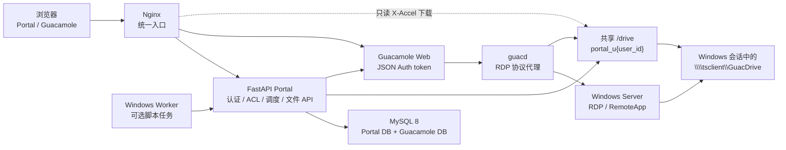
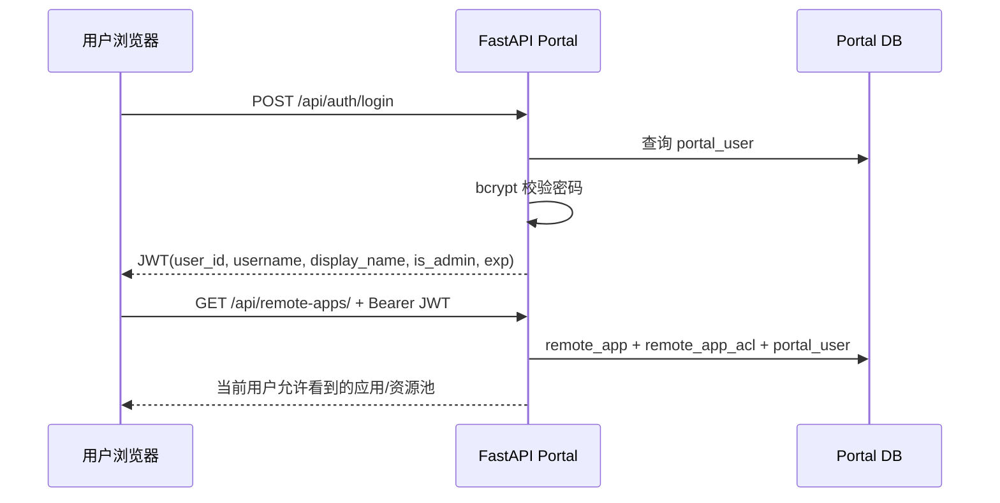
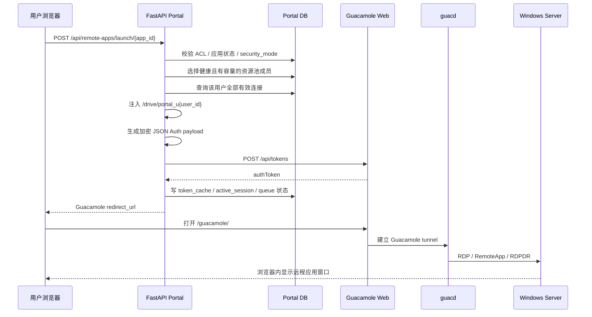
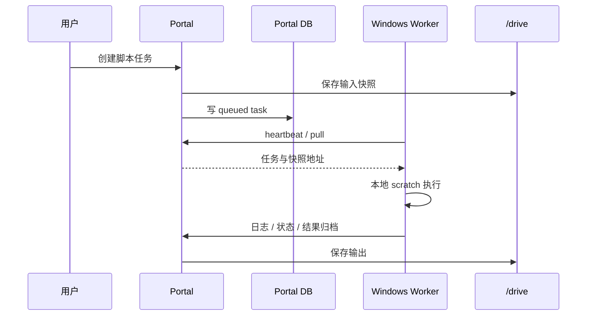

# Guacamole RemoteApp Portal

> 文档定位：项目总览、真实技术架构、核心事件流程、用户文件隔离机制、Windows RemoteApp 主机配置和新服务器标准流程。
> 当前架构快照：2026-07-26。生产 Portal 的详细部署参数见 [`deploy/readme.md`](deploy/readme.md)，Windows 一般限制的执行与验收细节见 [`docs/2026-07-26-guacdrive-general-restriction-runbook.md`](docs/2026-07-26-guacdrive-general-restriction-runbook.md)。

## 1. 项目是什么

本项目是 Apache Guacamole 前置的 FastAPI RemoteApp 门户。用户不直接操作 Guacamole 的登录页、连接树和管理界面，而是：

1. 登录 Portal。
2. 根据 Portal ACL 查看允许使用的软件。
3. 点击应用卡片。
4. Portal 按容量、健康状态和并发规则选择 Windows 运行实例。
5. Portal 创建或复用当前用户的 Guacamole JSON Auth token。
6. 浏览器进入 Guacamole RemoteApp 会话。
7. Windows 只显示被发布的应用窗口，而不是默认提供完整桌面。

系统目前同时包含两个执行平面：

- **GUI RemoteApp 平面**：Guacamole + guacd + Windows RDP/RemoteApp 主机。
- **脚本任务平面（可选）**：Portal 任务队列 + 独立 Windows Worker 节点。

GUI RemoteApp 启动不依赖 Worker；Worker 只处理脚本任务、输入快照和结果回传。

## 2. 当前安全目标与边界

当前目标是 **一般访问限制**：

- 普通用户正常使用时只通过个人 `GuacDrive` 读写业务文件。
- 普通业务连接只发布指定 RemoteApp。
- 完整桌面和管理工具进入管理员连接域。
- 关闭普通业务 RemoteApp 的剪贴板、浏览器上传/下载、打印和麦克风等旁路通道。
- Windows 侧通过标准用户、入口策略、NTFS、AppLocker、Firewall 和会话清理降低常见绕过风险。

当前方案不是恶意代码不可突破的多租户硬隔离，原因是普通用户仍可能共享同一个 Windows 账号：

- 共享相同 Windows SID 和 access token。
- 共享 HKCU、用户 profile、Temp、Recent、部分应用缓存和 Windows 审计身份。
- GuacDrive 隔离不等于 Windows 本地盘权限隔离。
- 驱动器隐藏、禁用 Explorer 等入口不等于应用文件 API 失效。

需要严格文件授权或运行不可信代码时，应升级为：

- 每个用户使用独立 Windows 账号/SID，并使用 NTFS ACL；或
- 每租户独占 VM、主机或 Worker。

## 3. 技术栈

| 层次 | 当前技术 |
|---|---|
| Portal 后端 | Python 3.11、FastAPI、Pydantic、mysql-connector-python |
| Portal 前端 | Vue 3、TypeScript、Pinia、Vite、Vitest |
| 认证 | Portal JWT、bcrypt；Guacamole JSON Authentication |
| RemoteApp 协议 | Apache Guacamole、guacd、RDP、RAIL/RemoteApp、RDPDR drive redirection |
| 数据库 | MySQL 8，包含 Guacamole 库和 Portal 业务库 |
| 入口与文件下载 | Nginx、WebSocket 反向代理、`X-Accel-Redirect` |
| 部署 | Docker Compose；生产推荐 Linux Docker Engine |
| Windows 主机策略 | 本地账号/组、用户策略、NTFS、AppLocker、Windows Firewall、Scheduled Task |
| 可选任务执行 | Windows Worker、快照、队列、心跳、结果归档 |

权威完整部署入口是：

```text
deploy/docker-compose.yml
```

仓库根目录旧 `docker-compose.yml` 是较早的 Guacamole-only 栈，不用于当前完整 Portal 部署。

## 4. 总体架构



`/drive` 的实际挂载关系：

- `portal-backend`：读写，用于文件 API、配额和任务快照。
- `guacd`：读写，将指定目录通过 RDPDR 映射到 Windows 会话。
- `nginx`：只读，用于 `X-Accel-Redirect` 下载。
- `guac-web`：不直接挂载 `/drive`。

### 4.1 组件职责与代码入口

| 组件 | 职责 | 关键入口 |
|---|---|---|
| Nginx | `/api`、`/guacamole/`、WebSocket、上传和内部文件下载 | `deploy/nginx/conf.d/portal.conf` |
| FastAPI 装配 | 注册认证、应用、资源池、监控、文件、任务和 Worker 路由；启动清理/探测循环 | `backend/app.py` |
| Portal 认证 | bcrypt 登录、JWT 签发、Bearer 校验、管理员守卫 | `backend/auth.py` |
| RemoteApp 启动 | ACL、安全模式、资源池选择、Guacamole 连接构建、会话记录 | `backend/router.py` |
| Guacamole 加密 | JSON Auth payload、HMAC、AES、RDP/RemoteApp 参数映射 | `backend/guacamole_crypto.py` |
| Guacamole 服务 | token 创建、验证、双层缓存、重定向 URL | `backend/guacamole_service.py` |
| 资源池/队列 | 容量、健康探测、成员选择、并发限制、排队 | `backend/resource_pool_service.py` |
| 文件空间 | 配额、目录、断点上传、下载 token、删除和移动 | `backend/file_router.py` |
| VSCode 策略 | 权限目录、白名单、固定 profile 路径和启动参数 | `backend/vscode_policy_service.py` |
| Worker 平面 | 注册、心跳、拉取任务、日志和结果归档 | `backend/worker_router.py`、`backend/worker_service.py` |

### 4.2 稳定 API 前缀

```text
/api/auth
/api/remote-apps
/api/admin
/api/monitor
/api/admin/monitor
/api/files
/api/datasets
/api/tasks
/api/worker
/guacamole/
/internal-drive/
```

不要随意修改这些前缀，现有 Vue、旧静态页面、Nginx 和 Worker 都依赖它们。

## 5. 三类地址必须分清

| 地址 | 示例 | 用途 |
|---|---|---|
| Portal 外部地址 | `https://portal.example.com` | 浏览器和 Worker 访问 |
| 容器内部 Guacamole 地址 | `http://guac-web:8080/guacamole` | Portal backend 创建/验证 token |
| Windows RemoteApp 主机地址 | `192.168.56.6:3389` | guacd 最终建立 RDP 会话 |

关键规则：

- `PORTAL_HOST` 不是 RDP 主机地址。
- Windows 地址来自数据库 `remote_app.hostname` 和 `remote_app.port`。
- 外部入口与 Docker 监听地址不同的时候，必须设置 `PORTAL_PUBLIC_HOST` / `PORTAL_PUBLIC_PORT`。
- Portal 会尽量根据 `Host`、`X-Forwarded-Proto` 等请求头重建浏览器可访问的 Guacamole URL，不能在代码中硬编码 localhost。

## 6. 核心事件流程

### 6.1 登录与应用列表



普通用户在查询和 ACL 更新阶段都会过滤 `admin_desktop`，不是只在前端隐藏卡片。

### 6.2 RemoteApp 启动



Portal 使用 Guacamole JSON Authentication 约定生成 token payload：

```text
username + expires + connections
  → JSON
  → HMAC-SHA256 签名
  → sign + data
  → PKCS7 padding
  → AES-128-CBC（Guacamole JSON Auth 约定的零 IV）
  → Base64
  → POST /guacamole/api/tokens
```

### 6.3 为什么一个 Portal 用户复用一个 Guacamole token

Portal 会把该用户可访问的全部连接放入同一个 JSON Auth payload，并按 Portal 用户缓存 token：

```text
内存缓存
  ↓ miss
token_cache 表
  ↓ miss/过期/无效
重新 POST /api/tokens
```

这是为了避免 Guacamole 在浏览器 localStorage 中保存新 token 时，把旧标签页正在使用的 token 覆盖掉。

应用、ACL、VSCode 策略或连接参数发生变化后必须：

1. 调用 `invalidate_all_sessions()` 或清空对应 token cache。
2. 确认运行中的 backend 内存缓存也被清理；必要时重启 `portal-backend`。
3. 结束旧 Windows 会话后重新启动。
4. 以 Windows `Win32_Process.CommandLine` 核对最终参数，不能只看数据库。

### 6.4 文件上传和下载

上传流程：

```text
Browser
  → Nginx upload streaming
  → FastAPI upload/init
  → 分片 upload/chunk
  → 校验 offset / 大小 / 配额
  → 完成后原子移动到 /drive/portal_u{user_id}
```

下载流程：

```text
Browser
  → FastAPI 申请短期 download token
  → FastAPI 校验用户、路径和 token
  → 返回 X-Accel-Redirect
  → Nginx 从 /internal-drive/ 对应 /drive 文件发送
```

FastAPI 不直接流式发送业务文件，避免大文件长期占用 Python worker。

### 6.5 可选 Worker 任务流程



Worker 是独立 Windows 节点，不是 Guacamole RemoteApp 会话。

### 6.6 后台控制循环

FastAPI 进程还持续执行：

- stale/idle Portal session 清理与回收；
- Windows 运行实例 TCP 健康探测；
- launch queue 调度；
- Worker offline/stalled 状态协调；
- 过期断点上传清理。

这些循环维护的是 Portal 控制面状态。TCP 3389 healthy 只说明网络端口可达，不代表 Windows 凭据、RemoteApp alias、应用进程和第三方许可证都正常。

## 7. 数据模型

| 表 | 用途 |
|---|---|
| `portal_user` | Portal 用户、管理员标识、配额 |
| `remote_app` | RDP 主机、Windows 凭据、RemoteApp alias/目录/参数、安全模式和通道参数 |
| `remote_app_acl` | Portal 用户可以访问哪些应用 |
| `vscode_control_profile` | VSCode 权限、shell/工具/调试器/扩展/网络白名单 |
| `resource_pool` | 逻辑资源池、总并发和队列策略 |
| `resource_pool_member` | 资源池成员与应用运行实例 |
| `remote_app_health` | TCP 健康探测、失败原因和 cooldown |
| `token_cache` | Portal 用户对应的 Guacamole token 缓存 |
| `active_session` | Portal 逻辑会话、心跳和回收状态 |
| `launch_queue` | 资源不足时的启动排队 |
| `audit_log` | 登录、启动、策略阻断、文件操作等审计 |
| Worker/Task 相关表 | Worker 注册、心跳、任务、输入/输出和状态流转 |

`active_session` 表示 Portal/浏览器逻辑会话，不等于 Windows 上某个软件进程或第三方许可证已经实际占用。

## 8. 用户文件隔离是如何实现的

### 8.1 每用户目录

Portal 根据 JWT 中的 `user_id` 固定生成：

```text
/drive/portal_u{user_id}
```

例如：

```text
Portal 用户 2 → /drive/portal_u2
Portal 用户 3 → /drive/portal_u3
```

guacd 只把当前 Portal 用户的目录映射给本次连接。Windows 会话统一看到：

```text
\\tsclient\GuacDrive
```

两个用户看到的盘名相同，但背后对应不同 Linux/Docker 目录。

### 8.2 隔离层次

| 层次 | 技术手段 | 当前作用 | 是否构成 Windows 硬隔离 |
|---|---|---|---|
| Portal 身份 | JWT 中的 `user_id` | 确定用户和个人目录 | 否 |
| Portal ACL | `remote_app_acl` | 控制用户可见和可启动的应用 | 否 |
| 文件 API | `_safe_resolve()`、路径规范化、Windows 文件名校验 | 阻止 `..`、绝对路径和越出个人目录 | 仅保护 Portal API |
| 存储目录 | `/drive/portal_u{user_id}` | 每个 Portal 用户独立目录 | 保护 Linux/Portal 侧路径 |
| Guacamole token | 每用户连接集合和 token | 防止拿到未授权连接 | 否 |
| RDPDR | guacd `drive-path` | 只映射当前用户的 GuacDrive | 否 |
| 通道控制 | 禁剪贴板、浏览器传输、打印、音频输入 | 减少文件旁路和数据通道 | 否 |
| Windows 入口限制 | NoDrives、NoViewOnDrive、禁 Run/控制面板/任务管理器等 | 阻止常规 UI 入口 | 否 |
| Windows 身份 | 标准账号、管理员账号分域 | 限制系统权限 | 共享账号时不是租户隔离 |
| NTFS ACL | 限制 profile、数据目录、管理目录 | Windows 文件授权的核心 | 使用独立 SID 时才是强边界 |
| AppLocker | EXE/Script/MSI Enforced、DLL Audit | 阻止常用逃逸工具和未批准程序 | 程序控制，不是文件 ACL |
| Firewall | SMB/WebDAV/非必要出口限制 | 阻止网络共享和外部通道 | 网络边界 |
| 会话清理 | Scheduled Task 清理 Temp/Recent/缓存 | 减少共享账号残留 | 事后清理，不是实时授权 |

### 8.3 Portal API 隔离和 Windows 会话隔离不是一回事

Portal 文件 API 会把所有路径限制在当前用户目录内，这个边界只对：

```text
/api/files/*
```

有效。

Windows RemoteApp 进程不经过 Portal 文件 API。允许的 Windows 应用仍可能通过：

- 文件打开对话框；
- 绝对路径；
- APPDATA/TEMP/ProgramData；
- 插件、宏、脚本和子进程；
- 本地或网络文件 API；

访问共享 Windows 账号有权读取的其他位置。

因此当前描述必须使用：

```text
一般限制 / 正常流程只使用个人 GuacDrive
```

不能使用：

```text
硬隔离 / 任何情况下只能访问 GuacDrive
```

## 9. 三种连接安全模式

| 模式 | 使用者 | 行为 |
|---|---|---|
| `restricted_remoteapp` | 普通业务应用 | RemoteApp 必须非空；强制关闭双向剪贴板、浏览器上传/下载、打印和音频输入 |
| `restricted_vscode` | 受控开发环境 | 固定 GuacDrive 工作区和每 Portal 用户独立 profile/extensions，权限由 `vscode_control_profile` 计算 |
| `admin_desktop` | 管理员 | 允许完整桌面；普通用户查询和 ACL 更新均拒绝 |

VSCode 当前生成的核心参数类似：

```text
--user-data-dir="C:\PortalProfiles\{user_id}"
--extensions-dir="C:\PortalExtensions\{user_id}"
--disable-gpu
--disable-workspace-trust
"\\tsclient\GuacDrive"
```

Windows 主机还要为对应 Portal 用户写入：

```json
{
  "security.allowedUNCHosts": ["tsclient"],
  "security.restrictUNCAccess": true
}
```

否则 VSCode 会因为 UNC host 或 Workspace Trust 提示阻断正常启动。

## 10. 当前 Windows Server 试点配置

以下为 2026-07-26 的实际试点快照，不代表正式生产完成状态。

### 10.1 主机与管理

| 项目 | 当前值 |
|---|---|
| 主机名 | `WIN-UGUPI2FHM86` |
| 操作系统 | Windows Server 2019 Standard |
| 地址 | `192.168.56.6/24` |
| 网关 | `192.168.56.2` |
| RDP | TCP 3389、NLA、drive redirection 开启 |
| WinRM | HTTPS 5986 已配置；HTTP 5985 仍存在于试点基线 |
| 管理方式 | 管理员账号与普通 RemoteApp 账号分离 |

凭据没有写入仓库、README、日志或 Git 提交。

### 10.2 Windows 账号与应用域

| 账号/组 | 用途 |
|---|---|
| 管理员账号 | 带外管理、完整桌面、策略恢复 |
| `GuacRemoteApp` | 记事本、计算器等严格普通 RemoteApp |
| `GuacVscode` | VSCode 受控开发连接 |
| `GuacRestrictedRemoteApp` | 普通 RemoteApp AppLocker/策略组 |
| `GuacRestrictedVscode` | VSCode AppLocker/策略组 |

两个普通账号：

- 不是 Administrators 成员。
- 加入 Remote Desktop Users。
- 与管理员桌面账号分开。
- 当前仍是供多个 Portal 用户复用的共享 Windows 账号。

已发布 RemoteApp：

```text
记事本
Windows Calculator
Visual Studio Code
Google Chrome（已发布但普通安全域不应默认授权）
```

### 10.3 RDP 和 RemoteApp

当前关键值：

```text
fDenyTSConnections=0
fSingleSessionPerUser=0
RDP-Tcp PortNumber=3389
UserAuthentication=1
SecurityLayer=2
fDisableCdm=0
```

含义：

- 允许 RDP。
- 同一个共享 Windows 账号可以建立多个会话。
- 启用 NLA。
- 保留 RDP drive redirection，这是 GuacDrive 能出现的前提。

### 10.4 用户入口策略

普通账号 profile 中已应用的主要限制包括：

- 隐藏/限制 C、D 等本地盘入口。
- 禁用 Run、控制面板、任务管理器、注册表工具等常规入口。
- 限制网络驱动器映射入口。
- `GuacRemoteApp` 禁用 cmd；`GuacVscode` 保留受控终端能力。
- Desktop、Documents、Downloads 指向或限制到 `\\tsclient\GuacDrive` 的正常工作流。
- 保护关键策略注册表键，普通账号只能读取。

这些策略主要控制 Explorer 和公共 UI，不替代 NTFS ACL。

### 10.5 NTFS 与目录

当前建立的核心目录：

```text
C:\Apps
C:\PortalProfiles
C:\PortalExtensions
C:\ProgramData\GuacDriveRestriction
```

当前权限原则：

- `C:\Apps` 对普通应用组保留 Read & Execute。
- `C:\PortalProfiles`、`C:\PortalExtensions` 给 VSCode 组必要的修改权限。
- 普通账号保持标准用户权限。
- 不对整个 `C:\` 设置递归粗暴 Deny，以免破坏 Windows 和应用加载。

当前 NTFS 规则仍属于试点基线，其他 profile、业务数据卷、备份目录和第三方软件专属目录还需要逐项验收。

### 10.6 AppLocker

当前状态：

| Collection | 模式 |
|---|---|
| EXE | Enforced |
| Script | Enforced |
| MSI | Enforced |
| DLL | AuditOnly |

普通 RemoteApp 组显式阻止的典型入口：

```text
explorer.exe
cmd.exe
powershell.exe
wscript.exe / cscript.exe
mshta.exe
mmc.exe
taskmgr.exe
control.exe
reg.exe / regedit.exe
rundll32.exe
msiexec.exe
schtasks.exe
sc.exe
net.exe
certutil.exe
bitsadmin.exe
curl.exe / ftp.exe / tftp.exe
wmic.exe
```

还限制浏览器、Node、Python、Git、Sandboxie、VNC 等当前试点不允许的通用执行入口。

实际负向测试已产生 AppLocker 8004 阻断事件：

- `GuacRemoteApp` 启动 `cmd.exe` 被阻止。
- `GuacVscode` 启动 `explorer.exe` 被阻止。

允许的记事本、计算器和 VSCode 在 Enforced 下仍能启动。

### 10.7 Firewall 和网络

当前试点：

- 三个 Firewall profile 均启用。
- 默认入站为 Block。
- 仅管理网段放行 RDP 3389、WinRM HTTPS 5986；试点仍保留 HTTP 5985。
- 阻断 SMB TCP 139/445 和 NetBIOS UDP 137/138 出站。
- WebClient/WebDAV 服务被停用。
- 默认出站仍是 Allow。

因此当前只完成 SMB/WebDAV 基础阻断，许可证、数据库、Git、包仓库、AI/MCP 和业务服务的精确 HOST/PORT allowlist 尚未收口。

### 10.8 VSCode 企业策略和独立 profile

当前主机已配置：

- `AllowedExtensions`：默认拒绝未登记扩展，只允许试点批准项。
- `UpdateMode=none`：避免共享主机上的自动更新改变二进制和 AppLocker 依赖。
- Portal 用户 1、2、3 分别初始化独立的 `C:\PortalProfiles\ID`。
- Portal 用户 2、3 已真实并发验证：user-data 和 extensions 目录不同，各自只看到个人 GuacDrive。

新增 Portal 用户后必须执行：

```powershell
powershell -File scripts\windows\set-vscode-guacdrive-profile-settings.ps1 `
  -PortalUserIds USER_ID `
  -DiscoverExistingProfiles
```

### 10.9 会话清理

当前注册了 SYSTEM Scheduled Task：

```text
GuacDrive Restricted Profile Cleanup
```

触发：

- 系统启动。
- 每 15 分钟。

无对应 Windows 会话时清理：

- Desktop、Documents、Downloads。
- `%LOCALAPPDATA%\Temp`。
- Recent。
- VSCode Cache、CachedData、Code Cache、GPUCache、logs、Service Worker CacheStorage、workspaceStorage。

清理是降低共享账号残留的补充措施，不能代替独立 SID/NTFS ACL。

### 10.10 当前已验证结果

- Portal、MySQL、Guacamole、guacd、Nginx 容器健康。
- 普通用户看不到 `admin_desktop`。
- 记事本和计算器 RemoteApp 正常。
- GuacDrive 中的文件可以打开、修改和保存。
- Portal 用户 A/B 的 GuacDrive 内容互不可见。
- VSCode A/B 同时运行，最终命令行使用独立 profile/extensions 路径。
- AppLocker Enforced 下允许程序正常，`cmd.exe` / `explorer.exe` 被阻止。
- Windows 试点检查脚本通过，RDS 缺失作为 warning 保留。

### 10.11 当前未完成和高风险项

- 未安装正式 `RDS-RD-Server` / RDS Session Host。
- 当前 `TermService\Parameters\ServiceDll` 指向 RDP Wrapper。
- 未配置正式 RDS Licensing Server / CAL。
- Defender 被本地策略关闭。
- 存在待安装的 Windows Server 2019、.NET 累积更新和恶意软件删除工具。
- Windows 更新可能改变 `termsrv.dll` 并使 RDP Wrapper 失效。
- 出站网络仍不是精确 allowlist。
- DLL AppLocker 仍是 AuditOnly。
- 未完成真实 ANSYS、COMSOL 等仿真软件的子进程、临时目录、恢复目录和许可证依赖验收。

正式上线顺序应是：

```text
VM 快照
→ 正式 RDS Session Host + Licensing/CAL
→ 移除 RDP Wrapper
→ 恢复 Defender
→ 安装 Windows 更新
→ 重新验证 RemoteApp/AppLocker/GuacDrive
```

## 11. 配置新的 Windows RemoteApp 服务器

### 11.1 先确定生产边界

配置前先明确：

1. 是试点还是生产。
2. 是否需要多个并发用户。
3. 是否已有 RDS CAL 和 Licensing Server。
4. 普通用户是否继续共享 Windows 账号。
5. 是否要求严格文件隔离。
6. 需要发布哪些软件、子进程和许可证端点。

生产多会话必须优先使用正式 RDS Session Host 和许可证，不以 RDP Wrapper 作为标准方案。

如果要求用户绝对不能访问其他用户文件，应为不同 Portal 用户分配不同 Windows SID/账号；当前一个 `remote_app` 行固定保存一个 `rdp_username`，动态身份绑定还需要平台级模型扩展。

### 11.2 创建回滚基础

执行任何限制前：

1. 创建 VM snapshot。
2. 确认 VMware/Hyper-V/云控制台等带外入口可用。
3. 保留独立管理员账号，不使用普通 RemoteApp 账号恢复策略。
4. 导出 Portal 数据库关键表。
5. 导出 Windows 基线。

基线命令：

```powershell
powershell -File scripts\windows\export-guacdrive-security-baseline.ps1 `
  -OutputRoot C:\ProgramData\GuacDriveRestriction\baseline
```

至少保存：

- Windows 版本、功能、卷和更新状态。
- RDP、RemoteApp、WinRM listener。
- 本地用户/组。
- GPO 和注册表策略。
- NTFS SDDL。
- AppLocker effective policy。
- Firewall export。
- VSCode 版本、hash 和企业策略。

配置前必须确认所引用的 `scripts/windows` 文件已经在目标 Git 提交中存在。不要把本机未提交脚本当成可复制的部署包。

### 11.3 基础系统与远程管理

1. 设置稳定主机名、静态 IP、DNS、网关和时区。
2. 安装当前 Windows 安全更新并重启。
3. 确认 Defender/EDR 正常，不先为了兼容未知软件关闭防护。
4. 配置 WinRM HTTPS 5986，证书名称与管理地址匹配。
5. Firewall 只允许管理网段访问 3389/5986。
6. 确认 Portal/guacd 所在网络可以访问 Windows TCP 3389。

连通性检查：

```powershell
Test-NetConnection WINDOWS_HOST -Port 3389
Test-NetConnection WINDOWS_HOST -Port 5986
```

### 11.4 安装正式 RDS

完成 RDS CAL/Licensing 决策后再安装：

```powershell
Install-WindowsFeature RDS-RD-Server -IncludeManagementTools
Restart-Computer
```

重启后确认：

```powershell
Get-WindowsFeature RDS-RD-Server
```

然后配置：

- RDS Licensing Server。
- Per User 或 Per Device licensing mode。
- Session timeout、断开会话回收和最大并发策略。
- 保留 RDPDR drive redirection。

### 11.5 安装并盘点业务软件

在限制 AppLocker 之前安装：

- 目标 GUI 软件。
- 许可证客户端。
- 必需 VC++/.NET/Java/Python/MPI/GPU runtime。
- 插件、后处理器和导出组件。

为每个应用记录：

```text
主 EXE
RemoteApp alias
启动目录
启动参数
项目文件格式
子进程树
TEMP/APPDATA/ProgramData 路径
日志/恢复/缓存路径
许可证 HOST/PORT
所需网络目标
```

ANSYS、COMSOL 等复杂工程软件不能只记录主 EXE；还必须测试求解器、MPI、恢复文件、插件、宏和许可证组件。

### 11.6 创建账号和安全域

至少分开：

```text
管理员桌面账号
普通 restricted_remoteapp 账号/组
受控 VSCode 账号/组
```

普通账号要求：

- 标准用户。
- 不属于 Administrators。
- 只加入 Remote Desktop Users 和对应策略组。
- 禁止修改密码和任意安装软件的能力按运维策略控制。
- 生产严格文件隔离时，一个 Portal 用户对应一个 Windows SID。

### 11.7 创建目录和 NTFS ACL

推荐规划：

```text
C:\Apps                         # 只读应用目录
C:\PortalProfiles\{user_id}    # 每 Portal 用户 VSCode/profile
C:\PortalExtensions\{user_id}  # 每 Portal 用户扩展
C:\PortalScratch\{user_id}     # 大型仿真软件本地 scratch
C:\ProgramData\GuacDriveRestriction
```

原则：

- Windows、Program Files 和应用目录保留运行所需 Read & Execute。
- 管理员、SYSTEM 保留 Full Control。
- 用户自己的 profile/scratch 允许必要修改。
- 其他用户目录通过不同 SID 和 NTFS ACL 拒绝。
- 不对整个 `C:\` 递归 Deny。
- 共享 Windows 账号下，不要声称不同 `{user_id}` 本地目录形成硬隔离。

### 11.8 用户策略

普通 RemoteApp 域建议：

- 隐藏/限制本地盘入口。
- 禁 Run、控制面板、任务管理器、注册表和网络驱动器映射入口。
- 禁用或限制 Explorer 完整桌面能力。
- Desktop/Documents/Downloads 指向业务空间或禁止本地持久化。
- 配置会话结束清理。

域环境优先使用试点 OU + GPO loopback processing；独立工作组服务器可以使用本地策略/离线 user hive，但维护成本更高。

### 11.9 AppLocker 必须 Audit → Enforced

第一阶段：

```powershell
powershell -File scripts\windows\set-guacdrive-applocker-mode.ps1 -Mode AuditOnly
```

在 Audit 阶段真实运行：

- 主应用。
- 打开、保存、导入、导出。
- 求解、后处理、打印或渲染。
- 插件、宏、脚本和子进程。
- 许可证连接。

收集无缺口后切换：

```powershell
powershell -File scripts\windows\set-guacdrive-applocker-mode.ps1 -Mode Enabled
```

切换后重新执行全部正向和阻断场景。DLL 建议长时间 Audit，直接 Enforced 很容易把复杂工程软件打死。

### 11.10 Firewall

推荐默认策略：

- 入站 Block。
- 仅管理网段允许 RDP/WinRM。
- 阻断 SMB 445/139、NetBIOS 137/138、WebDAV 和管理员共享。
- 按 HOST/PORT 放行许可证、数据库、Git、包仓库和业务服务。
- 不使用 `*` 作为网络 allowlist。
- 完成真实应用验证后，再考虑将默认出站收紧为 Block + allowlist。

### 11.11 发布 RemoteApp

每个普通应用必须发布非空 RemoteApp alias，不能让受限模式回退完整桌面。

Portal `remote_app` 至少核对：

```text
name
hostname
port
rdp_username / credential
domain
security=nla
ignore_cert
remote_app
remote_app_dir
remote_app_args
security_mode
pool_id
member_max_concurrent
```

安全模式建议：

- 普通第三方软件：`restricted_remoteapp`。
- VSCode：`restricted_vscode` + `vscode_control_profile_id`。
- 管理员完整桌面：`admin_desktop`，只授权管理员。

应用、ACL 或策略修改后必须确认 Guacamole session cache 已失效。

### 11.12 配置 Portal ACL 和资源池

检查：

- `remote_app_acl`：普通用户只拥有普通 RemoteApp。
- `resource_pool` / `resource_pool_member`：主机成员、容量和健康状态正确。
- `remote_app_health`：TCP 3389 探测为 healthy。
- `member_max_concurrent`：不能超过真实 RDS、软件和许可证容量。

Portal TCP 健康探测只证明端口可连接，不证明：

- Windows 凭据正确；
- RemoteApp alias 存在；
- 软件能启动；
- 第三方许可证可用。

### 11.13 VSCode profile 初始化

同步当前 Portal 用户 ID：

```powershell
powershell -File scripts\windows\set-vscode-guacdrive-profile-settings.ps1 `
  -PortalUserIds 1,2,3 `
  -DiscoverExistingProfiles `
  -AllowedUNCHosts tsclient
```

新增 Portal 用户后必须重复执行，或者后续建设统一 Windows launcher/agent 自动完成 profile 初始化。

### 11.14 新服务器验收

#### 正向场景

- Portal 登录、应用列表和 ACL 正确。
- 记事本/计算器 smoke 成功。
- GuacDrive 新建、打开、覆盖、重命名和删除。
- 大文件传输和断线重连。
- 两个用户同时启动同一应用。
- VSCode A/B profile/extensions 路径不同。
- 允许的第三方软件子进程和许可证正常。

#### 阻断场景

- 普通用户看不到/启动不了 `admin_desktop`。
- `C:\`、`D:\`、其他用户 profile、数据卷和备份目录。
- `\\HOST\share`、`\\HOST\C$`、映射网络盘。
- Explorer、cmd、PowerShell、wscript/cscript、mshta、taskmgr、control、mmc、安装器。
- 普通 RemoteApp 的剪贴板、浏览器上传/下载、打印和麦克风。
- 未登记插件、扩展、工具链、调试器和网络目标。

#### 会话后检查

- Temp、Recent、Desktop、Downloads、缓存无业务残留。
- Portal `active_session` 最终回收。
- Portal 审计包含真实 Portal 用户、应用、资源和安全模式。
- Windows 审计明确共享账号时不能区分 Portal 身份。
- AppLocker 阻断有 8004/对应事件，而不是只看窗口没出现。

## 12. 配置新的 Portal 服务器

Portal 容器栈生产推荐部署在 Linux，而不是 Windows Server + Docker Desktop。

最小流程：

1. 准备 Linux、Docker Engine、Docker Compose v2。
2. 创建 MySQL 和 `/drive` 持久化目录。
3. 从 `deploy/.env.production.example` 生成 `deploy/.env`。
4. 配置强密码、JSON Auth key、JWT secret、外部域名和数据目录。
5. 使用 `deploy/docker-compose.yml` 启动。
6. 迁移/核对 Portal DB 和 Guacamole DB。
7. 更新 `remote_app.hostname` 为真实 Windows 主机。
8. 验证 Portal→Guacamole→guacd→Windows 的完整链路。

完整说明见：

- [`deploy/readme.md`](deploy/readme.md)
- [`docs/2026-04-10-production-server-deployment-manual.md`](docs/2026-04-10-production-server-deployment-manual.md)

生产环境不使用 `host_port_bridge.py`；它只解决 Windows 开发机 + Docker Desktop + WSL2 的端口暴露问题。

## 13. 本地启动

### 13.1 Python 环境

```powershell
.\.venv\Scripts\pip.exe install -r requirements.txt
```

### 13.2 仅启动后端

```powershell
.\.venv\Scripts\python.exe backend\app.py
```

### 13.3 Vue 开发服务器

```powershell
cd portal_ui
npm install
npm run dev
```

### 13.4 本地 Guacamole/MySQL 依赖

```powershell
cd deploy
docker compose up -d guacd guac-sql guac-web
```

### 13.5 完整 Docker 栈

```powershell
cd deploy
docker compose up -d --build
```

默认本地实例：

```text
http://127.0.0.1:18880/
```

实际地址以 `deploy/.env` 和 `docker compose ps` 为准。

## 14. 数据库初始化与迁移原则

- 新 volume 会执行 `deploy/initdb/` 下的 SQL。
- 已存在的 MySQL volume 不会自动重跑初始化脚本。
- 增量功能必须执行对应 `database/migrate_*.sql`。
- 手工导入必须使用 `--default-character-set=utf8mb4`。
- 迁移前备份 `remote_app`、`remote_app_acl`、`portal_user`、`token_cache`、`active_session`、`audit_log` 和相关策略/资源池表。
- 修改应用、ACL 或策略后确认 token cache 失效。

当前安全模式迁移：

```text
database/migrate_access_security_modes.sql
```

它增加 `restricted_remoteapp`、`restricted_vscode`、`admin_desktop` 和 VSCode profile 相关结构。

## 15. 验证命令

### 15.1 Python

```powershell
$base = (Resolve-Path '.').Path + '\.pytest-tmp\run'
.\.venv\Scripts\python.exe -m pytest tests `
  --ignore=tests\test_file_router.py `
  --basetemp=$base `
  -q
```

`tests/test_file_router.py` 不是标准 pytest 模块，并存在已知 `httpx ASGITransport` 兼容问题，不能用它代表完整测试绿灯。

### 15.2 Vue

```powershell
cd portal_ui
npm run typecheck
npm test
npm run build
```

### 15.3 Schema

```powershell
$env:PORTAL_DB_PORT='PORT'
.\.venv\Scripts\python.exe scripts\verify_portal_schema.py
```

### 15.4 Docker/HTTP

```powershell
docker compose --env-file deploy\.env -f deploy\docker-compose.yml ps
Invoke-RestMethod http://127.0.0.1:18880/health/ready
```

### 15.5 Windows 试点

```powershell
powershell -File scripts\windows\test-guacdrive-restriction-pilot.ps1 `
  -ExpectedAppLockerMode Enabled
```

自动检查通过后仍必须执行真实浏览器 RemoteApp 验收。

## 16. 备份与回滚

### 16.1 代码

当前一般限制回滚基线：

```text
分支：codex/backup-general-restriction-20260725
标签：backup-general-restriction-20260725-dcfd0c0
```

常规回滚按文件或提交执行，不自动整体 hard reset。

### 16.2 Portal 数据

备份：

- Guacamole DB。
- Portal DB。
- `/drive`。
- 生产 `.env` 和密钥的安全副本。

数据库恢复前先停止 Portal 写入。

### 16.3 Windows

Windows 基线和备份目录：

```text
C:\ProgramData\GuacDriveRestriction\baseline
C:\ProgramData\GuacDriveRestriction\backups
```

试点回滚结构应包含：

- AppLocker effective XML。
- Firewall `.wfw`。
- RDP users 和关键注册表值。
- RemoteApp 命令行策略。
- VSCode 企业策略。
- 用户/组。
- 关键目录 ACL SDDL。

回滚原则：

- AppLocker Enforced 先退回 AuditOnly。
- GPO/NTFS/Firewall 只回滚试点安全域。
- 始终保留带外管理员通道。
- `-RemoveCreatedAccounts` 前确认账号是本次创建的，避免误删同名既有账号。

## 17. 当前剩余工作

- 正式 RDS Session Host / Licensing Server / RDS CAL。
- 移除 RDP Wrapper。
- 恢复 Defender 并安装 Windows 更新。
- Firewall 精确出站 allowlist。
- DLL AppLocker 依赖收集。
- 完成 GPO/NTFS 完整逃逸矩阵。
- 为 ANSYS、COMSOL 等真实业务软件建立启动器、工作/临时/恢复目录和子进程策略。
- 共享账号升级为独立 Windows SID 或独占 VM，以支持严格文件隔离。
- 将所有实际使用的 Windows 部署脚本审计后纳入 Git，避免依赖本地未提交文件。

## 18. 文档导航

| 文档 | 用途 |
|---|---|
| [`deploy/readme.md`](deploy/readme.md) | Portal 容器栈生产部署 |
| [`docs/2026-04-10-production-server-deployment-manual.md`](docs/2026-04-10-production-server-deployment-manual.md) | 完整生产服务器部署手册 |
| [`docs/2026-07-26-guacdrive-general-restriction-runbook.md`](docs/2026-07-26-guacdrive-general-restriction-runbook.md) | Windows 一般限制实施与验收 |
| [`docs/personal-space-design.md`](docs/personal-space-design.md) | 个人空间和文件链路设计 |
| [`docs/2026-04-10-worker-installation-manual.md`](docs/2026-04-10-worker-installation-manual.md) | Windows Worker 安装 |
| [`issue_log.md`](issue_log.md) | 当前逻辑、历史问题、原因和防重复约束 |
| [`.trellis/tasks/07-25-guacdrive-access-isolation/`](.trellis/tasks/07-25-guacdrive-access-isolation/) | GuacDrive 一般限制 PRD、设计和实施状态 |

## 19. 三条必须记住的规则

1. **GuacDrive 是 per-Portal-user 虚拟盘隔离，不是 Windows 主机硬隔离。**
2. **生产多会话使用正式 RDS + Licensing/CAL，不把 RDP Wrapper 当生产标准。**
3. **新增应用或服务器必须从 Audit、真实浏览器和双用户验证开始，不能只看端口健康或配置文件。**
