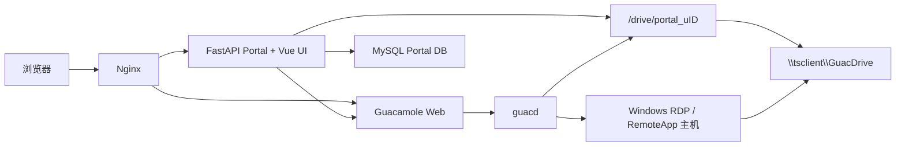
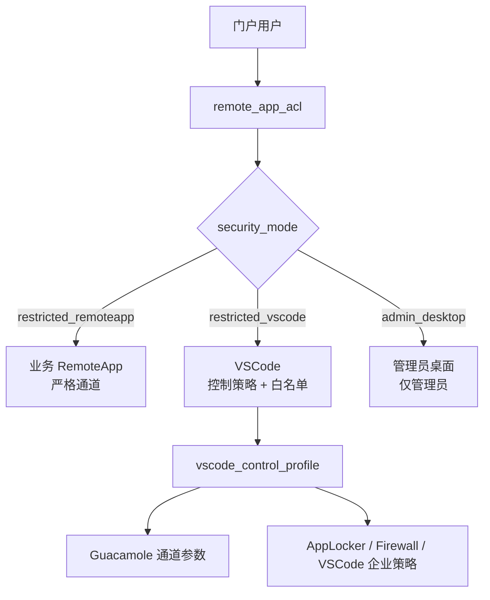

# Guacamole RemoteApp Portal

## 1. 项目目标

本项目是 Apache Guacamole 前置的 FastAPI RemoteApp 门户。用户登录门户后点击应用卡片，系统按 ACL 和容量策略选择远程运行实例，并直接进入 Guacamole RemoteApp 会话。

当前安全目标是“一般访问限制”：普通用户在正常操作和常见绕过路径下只使用自己的 GuacDrive，完整桌面与管理工具进入管理员连接域。该模式不是恶意代码不可突破的多租户硬隔离。

## 2. 核心需求

- 每个门户用户固定使用 `/drive/portal_u{user_id}`，Windows 会话中显示为 `\\tsclient\GuacDrive`。
- 保留 Guacamole per-user token/session 多标签复用；应用、ACL 或安全策略变化后必须失效缓存。
- 普通业务应用使用 `restricted_remoteapp`，强制关闭剪贴板、浏览器上传/下载、打印和麦克风。
- VSCode 使用 `restricted_vscode`，每个门户用户使用独立 user-data/extensions 目录，并通过控制策略管理终端、Tasks、Debug、扩展、网络和 Guacamole 通道。
- 完整桌面使用 `admin_desktop`，只能授权给管理员。
- 新建 VSCode 策略时全部可授予权限默认勾选；程序、扩展、路径和网络白名单属于不可关闭的安全基线。

## 3. 技术环境

- Windows-first 开发环境
- Python 3.11、FastAPI、Pydantic、mysql-connector-python
- Vue 3、TypeScript、Pinia、Vite、Vitest
- Apache Guacamole、guacd、MySQL 8、Nginx、Docker Compose

权威启动文件是 `deploy/docker-compose.yml`。仓库根目录旧 Compose 不包含完整门户部署，不用于正式启动。

## 4. 总体架构



### 安全模式



## 5. 启动与开发

### 后端

```powershell
.\.venv\Scripts\python.exe backend\app.py
```

### 前端

```powershell
cd portal_ui
npm run dev
```

### 完整 Docker 栈

```powershell
cd deploy
docker compose up -d --build
```

默认本地实例可通过 `http://127.0.0.1:18880/` 访问，实际端口以 `deploy/.env` 和 Compose 状态为准。

## 6. 数据库迁移

新部署会导入 `deploy/initdb/01-portal-init.sql`。已有 MySQL volume 不会自动重跑初始化脚本，必须手工执行增量迁移。

本次一般限制迁移：

```powershell
docker cp database\migrate_access_security_modes.sql CONTAINER:/tmp/migrate_access_security_modes.sql
docker exec CONTAINER sh -c 'mysql -uroot -p"$MYSQL_ROOT_PASSWORD" --default-character-set=utf8mb4 < /tmp/migrate_access_security_modes.sql'
```

迁移会：

- 创建 `vscode_control_profile`。
- 为 `remote_app` 增加 `security_mode` 和 `vscode_control_profile_id`。
- 将空 `remote_app` 分类为 `admin_desktop`，VSCode 分类为 `restricted_vscode`，其余分类为 `restricted_remoteapp`。
- 移除普通用户遗留的管理员桌面 ACL。
- 创建未启用的 `default-controlled` 策略；全部权限默认勾选，但白名单为空，因此在补齐前保持 invalid。

## 7. 功能逻辑

### RemoteApp 启动

1. Portal 根据 `remote_app_acl` 和资源池状态选择运行实例。
2. 普通用户查询会过滤 `admin_desktop`。
3. 后端一次构建该用户所有有效连接，保持多标签 token 复用。
4. `restricted_remoteapp` 覆盖应用字段并强制严格通道。
5. `restricted_vscode` 校验策略、白名单和固定路径，生成当前用户专属启动参数。
6. 无效连接不会污染其他连接；启动目标无效时返回策略阻断原因并写审计。

### VSCode 策略

- 后端 `backend/vscode_policy_service.py` 是权限目录、默认值、校验和最终生效策略的唯一来源。
- 管理入口：`/admin/vscode-policies`。
- UI 支持全选、全不选、恢复默认、白名单编辑、锁定基线和最终生效预览。
- 策略只有在必需白名单完整时才能启用或绑定。
- 启动参数由固定根目录生成，不执行任意 `format()`，最终参数中不存在字面量 `{user_id}`。
- Windows 主机需要为每个已知 Portal 用户初始化 `C:\PortalProfiles\{user_id}\User\settings.json`，只允许 UNC 主机 `tsclient`；启动参数固定加入 `--disable-workspace-trust`，使个人 GuacDrive 可直接作为受控开发工作区。

## 8. 一般限制的边界

Portal 和 Guacamole 可以约束 ACL、连接形态、虚拟盘和通道，但 Windows 本地盘访问最终仍由 Windows 账号、GPO、NTFS、AppLocker、Firewall 和允许应用自身能力决定。

共享 Windows 账号仍共享 HKCU、Temp、Recent、应用缓存和 Windows 审计身份。高敏、多租户或不可信代码场景应升级为独立 Windows 账号或独占 VM/Worker。

Windows 试点步骤和验收矩阵见 `docs/2026-07-26-guacdrive-general-restriction-runbook.md`。

当前试点主机 `WIN-UGUPI2FHM86`（Windows Server 2019，`192.168.56.6`）已完成低权限账号分域、RDPDR、AppLocker Enforced、VSCode 扩展策略、SMB/WebDAV 基础阻断和真实浏览器 A/B 会话验证。该主机仍使用 RDP Wrapper，Windows Defender 被策略关闭且存在待安装累积更新；在确定正式 RDS Session Host / RDS CAL 方案前，不应把它认定为生产完成状态。

新增或恢复 Portal 用户后，在 Windows 主机执行：

```powershell
powershell -File scripts\windows\set-vscode-guacdrive-profile-settings.ps1 `
  -PortalUserIds USER_ID `
  -DiscoverExistingProfiles
```

修改 VSCode 启动参数后还必须清空 `token_cache` 并重启 `portal-backend`，否则运行进程可能继续使用旧 Guacamole token 中的连接参数。

## 9. 验证命令

```powershell
$base = (Resolve-Path '.').Path + '\.pytest-tmp\run'
.\.venv\Scripts\python.exe -m pytest tests --ignore=tests\test_file_router.py --basetemp=$base -q

cd portal_ui
npm run typecheck
npm test
npm run build
```

`tests/test_file_router.py` 不是标准 pytest 模块，并存在已知 `httpx ASGITransport` 兼容问题，不能用它代表完整测试绿灯。

实时 Schema 校验时，本机端口若与 `config/config.json` 不同，应通过环境变量覆盖：

```powershell
$env:PORTAL_DB_PORT='PORT'
.\.venv\Scripts\python.exe scripts\verify_portal_schema.py
```

## 10. 回滚

- 代码基线分支：`codex/backup-general-restriction-20260725`
- 代码基线标签：`backup-general-restriction-20260725-dcfd0c0`
- 数据库迁移前必须导出 `remote_app`、`remote_app_acl`、`portal_user`、`token_cache` 和 `audit_log`。
- Windows 策略先在试点 OU 使用 AppLocker Audit；Enforced、GPO、NTFS 和 Firewall 只按试点范围回滚。

历史问题与防重复约束见 `issue_log.md`。
