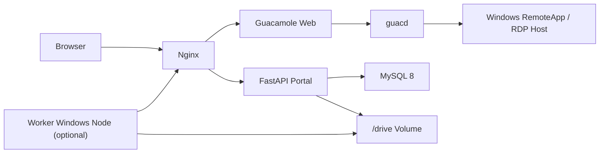

# Guacamole RemoteApp Portal — 生产部署指南

> 更新日期：2026-04-10  
> 推荐场景：**Linux 生产服务器**  
> 详细手册：`docs/2026-04-10-production-server-deployment-manual.md`

## 1. 先说最重要的

- **生产 Linux 服务器不需要 `host_port_bridge.py`。**
- `deploy/host_port_bridge.py` 只是开发机上为 Windows + Docker Desktop + WSL2 端口暴露问题准备的临时补丁。
- 真正生产部署应该直接使用 `deploy/docker-compose.yml` 暴露端口，或者让正式反向代理转发到它。
- **不要用仓库根目录那个旧 `docker-compose.yml`。** 真正入口是 `deploy/docker-compose.yml`。

## 2. 这个系统到底是什么

这不是一个纯 Guacamole demo，而是一个 **RemoteApp 门户系统**。

它负责两条主业务：

1. **RemoteApp / GUI 应用访问**
   - 用户登录门户
   - 点击应用卡片
   - 门户后端创建或复用 Guacamole token
   - 浏览器跳转进入 Guacamole 会话
2. **脚本任务派发（可选）**
   - 用户提交脚本任务
   - 门户生成输入快照
   - Worker Windows 节点拉取并执行
   - 执行结果回传门户并写入 `/drive`

## 3. 架构总览



### 3.1 组件职责

| 组件 | 作用 |
|---|---|
| `nginx` | 对外统一入口，转发 `/api`、`/guacamole/`、静态页 |
| `portal-backend` | FastAPI 门户后端，负责认证、RemoteApp 启动、任务编排 |
| `guac-web` | Guacamole Web 前端和 token 接收端 |
| `guacd` | RDP 协议代理 |
| `guac-sql` | MySQL，存 Guacamole 核心库和 Portal 业务库 |
| `/drive` | 用户文件、任务快照、任务输出 |
| Worker 节点 | 独立 Windows 主机，执行脚本任务 |

## 4. 包内容

```text
deploy/
├── .env.production.example      # 生产环境 .env 模板
├── .env                         # 当前环境配置（不要直接照抄开发值上生产）
├── docker-compose.yml           # 生产部署入口
├── docker-compose.debug.yml     # 开发调试覆盖，不用于生产
├── portal.Dockerfile            # FastAPI 镜像
├── guac-web.Dockerfile          # Guacamole Web 镜像
├── nginx/
│   ├── nginx.conf
│   └── conf.d/portal.conf       # 反向代理配置
├── initdb/
│   ├── 00-full-dump.sql         # 全量初始化快照
│   └── 01-portal-init.sql       # Portal schema / 增量初始化
├── backup.sh                    # 备份与恢复脚本
└── host_port_bridge.py          # 仅开发机补丁，生产不用
```

## 5. 部署前必须搞明白的三类地址

最常见的低级错误就是把下面三种地址混为一谈：

1. **Portal 外部访问地址**
   - 例如 `portal.example.com:8880`
   - 这是用户浏览器访问的地址
2. **容器内部服务地址**
   - 例如 `http://guac-web:8080/guacamole`
   - 这是容器之间互相访问的地址
3. **Windows RemoteApp 主机地址**
   - 存在数据库 `remote_app.hostname`
   - 例如 `10.10.20.15`
   - 这是 Guacamole 最终连的 Windows 主机

一句话：

- `PORTAL_HOST` 不是 RDP 主机地址
- `remote_app.hostname` 才是 RDP 主机地址

## 6. 推荐的生产部署模式

### 模式 A：Portal 自己直接对外提供服务

适合：

- 内网
- VPN
- 没有额外 HTTPS 网关

推荐配置：

```ini
PORTAL_BIND_IP=0.0.0.0
PORTAL_PORT=8880
PORTAL_HOST=portal.example.com
```

### 模式 B：前面还有正式反向代理 / HTTPS 网关

适合：

- 公网
- 需要 443 / TLS
- 有统一 Nginx / Caddy / LB / WAF

推荐配置：

```ini
PORTAL_BIND_IP=127.0.0.1
PORTAL_PORT=18880
PORTAL_HOST=portal.example.com
```

然后由外层正式代理反向转发到 `127.0.0.1:18880`。

### 不推荐模式

- Windows Server + Docker Desktop + bridge 硬上生产
- 继续沿用开发机 `192.168.56.x` 这类 VMware 网卡地址

## 7. 生产部署前准备

### 7.1 服务器要求

- Linux
- Docker Engine
- Docker Compose v2
- 可以访问目标 Windows RemoteApp 主机 `3389`
- 足够的磁盘给 MySQL 和 `/drive`

### 7.2 数据目录准备

```bash
sudo mkdir -p /srv/nercar-portal/mysql
sudo mkdir -p /srv/nercar-portal/drive
```

> MySQL 数据目录必须放在 Linux 本地文件系统上，别放到奇怪的共享盘。

## 8. 生产 `.env` 配置

最稳的做法：

1. 复制模板
2. 再改真实值

```bash
cd deploy
cp .env.production.example .env
```

推荐直接从 `deploy/.env.production.example` 开始，而不是继续拿开发机 `.env` 改。

### 8.1 最小可用生产示例

```ini
PORTAL_INSTANCE_ID=nercar-portal-prod

MYSQL_ROOT_PASSWORD=REPLACE_WITH_STRONG_ROOT_PASSWORD
MYSQL_USER=guacamole_user
MYSQL_PASSWORD=REPLACE_WITH_STRONG_GUAC_DB_PASSWORD
MYSQL_DATABASE=guacamole_db

JSON_SECRET_KEY=REPLACE_WITH_32_HEX_CHARS

PORTAL_HOST=portal.example.com
PORTAL_BIND_IP=0.0.0.0
PORTAL_PORT=8880
PORTAL_JWT_SECRET=REPLACE_WITH_LONG_RANDOM_JWT_SECRET

MYSQL_DATA_SOURCE=/srv/nercar-portal/mysql
GUAC_DRIVE_SOURCE=/srv/nercar-portal/drive

TZ=Asia/Shanghai
```

### 8.2 字段解释

| 变量 | 含义 | 生产建议 |
|---|---|---|
| `PORTAL_INSTANCE_ID` | compose 项目名 / volume 前缀 | 每套实例唯一 |
| `MYSQL_ROOT_PASSWORD` | Portal 后端连 portal DB 的 root 密码 | 必改强密码 |
| `MYSQL_PASSWORD` | Guacamole 自己连 `guacamole_db` 的业务用户密码 | 必改强密码 |
| `JSON_SECRET_KEY` | Portal 和 Guacamole 共用的 JSON auth 密钥 | 必改 |
| `PORTAL_HOST` | 用户访问门户的域名 / IP | 写真实域名或真实 IP |
| `PORTAL_BIND_IP` | 宿主机绑定地址 | 直接对外时用 `0.0.0.0` |
| `PORTAL_PORT` | 宿主机发布端口 | 常见 `8880` / `80` / `18880` |
| `PORTAL_JWT_SECRET` | JWT 签名密钥 | 必改 |
| `MYSQL_DATA_SOURCE` | MySQL 数据目录 | 强烈建议显式设置 |
| `GUAC_DRIVE_SOURCE` | `/drive` 数据目录 | 强烈建议显式设置 |

## 9. 哪些配置会被环境变量覆盖

`config/config.json` 里的数据库和 Guacamole 地址在 Docker 里会被环境变量覆盖。

也就是说，生产部署优先改：

- `.env`
- `deploy/docker-compose.yml`

而不是优先乱改：

- `config/config.json`

`config/config.json` 主要保留这些角色：

1. 默认值仓库
2. 脚本 profile 配置
3. drive / monitor / quota 等静态配置

## 10. 业务数据也必须改

这项目最阴的坑不是 `.env`，而是数据库业务数据没改。

### 10.1 `remote_app` 表必须核对

你必须确认：

- `hostname`
- `port`
- `remote_app`
- `remote_app_dir`
- `remote_app_args`

尤其是 `hostname`。

如果生产上的 Windows 主机不是开发环境那台，Portal 能启动也没用，点应用照样死。

### 10.2 ACL 和资源池也要核对

这些表也别装看不见：

- `remote_app_acl`
- `resource_pool`
- `resource_pool_member`

否则会出现：

- 门户能登录但看不到应用
- 看得到应用但排队异常

### 10.3 如果启用脚本任务，还要核对 Worker 相关表

- `app_binding`
- `worker_group`
- `worker_node`
- `worker_enrollment`
- `worker_auth_token`

## 11. 启动步骤

### 11.1 进入部署目录

```bash
cd deploy
```

### 11.2 复制并编辑生产 `.env`

```bash
cp .env.production.example .env
vi .env
```

### 11.3 启动整套服务

```bash
docker compose up -d --build
```

### 11.4 查看状态

```bash
docker compose ps
```

正常应该至少看到：

- `guac-sql` healthy
- `portal-backend` up
- `nginx` up

## 12. 启动后验收

### 12.1 健康检查

```bash
curl -s http://127.0.0.1:${PORTAL_PORT}/health
```

预期：

```json
{"status":"ok"}
```

### 12.2 检查数据库

```bash
docker compose exec -T guac-sql mysql -uroot -p你的密码 --default-character-set=utf8mb4 -e "SHOW DATABASES"
```

至少应该有：

- `guacamole_db`
- `guacamole_portal_db`

### 12.3 检查应用数据

```bash
docker compose exec -T guac-sql mysql -uroot -p你的密码 --default-character-set=utf8mb4 guacamole_portal_db -e "SELECT id, name, hostname, port FROM remote_app"
```

重点看：

- `hostname` 是否已经换成真实 Windows 主机
- 不是开发机 IP

### 12.4 浏览器验收

1. 登录页能打开
2. 管理员能登录
3. 用户能看到应用卡片
4. 点击 RemoteApp 能进入 Guacamole

## 13. Worker 部署（仅脚本任务需要）

Worker 不是容器的一部分，而是独立 Windows 主机。

Portal 只负责：

1. 保存 Worker 节点元数据
2. 发 enrollment token
3. 接收心跳和任务回传

如果你启用脚本任务，至少要做这些事：

1. 创建 `Worker Group`
2. 创建 `Worker Node`
3. 保证 `expected_hostname` 与实际主机名完全一致
4. 确认 `scratch_root`、`workspace_share` 正确
5. 发 enrollment token
6. 在 Worker 主机上注册
7. 保证 Worker 进程常驻

## 14. 日常运维

### 14.1 看日志

```bash
docker compose logs -f nginx
docker compose logs -f portal-backend
docker compose logs -f guac-web
docker compose logs -f guacd
docker compose logs -f guac-sql
```

### 14.2 重启

```bash
docker compose restart nginx portal-backend
docker compose restart guac-web
```

### 14.3 全量重建

```bash
docker compose up -d --build
```

### 14.4 备份

```bash
./backup.sh status
./backup.sh export
```

> 导入导出 MySQL 时一定带 `--default-character-set=utf8mb4`，不然中文迟早乱码。

## 15. 常见坑

### 15.1 不要继续用 bridge

生产 Linux 不需要它。  
如果你发现自己又想把 `host_port_bridge.py` 搬上服务器，说明你的入口设计已经歪了。

### 15.2 不要把 `PORTAL_HOST` 留成开发 IP

`192.168.56.x` 这种值一看就是开发机残留。

### 15.3 不要把 MySQL 暴露到公网

当前 compose 只绑定本机，这是对的。

### 15.4 不要忘记改 `remote_app.hostname`

这比没改密码还常见，而且更阴险。

### 15.5 不要误用旧 compose

真正入口只有：

- `deploy/docker-compose.yml`

## 16. 推荐上线顺序

1. 准备 Linux 服务器
2. 创建数据目录
3. 复制 `deploy/.env.production.example` 为 `deploy/.env`
4. 填真实配置
5. 启动 `docker compose up -d --build`
6. 验证 `/health`
7. 校验数据库和 `remote_app` 业务数据
8. 登录门户测试 RemoteApp
9. 如果启用脚本任务，再单独上线 Worker

## 17. 结论

这项目的生产部署主线其实不复杂：

- **Portal 容器栈** 负责入口、认证、RemoteApp 启动、任务编排
- **Windows 主机** 负责真正运行 RemoteApp
- **Worker 节点** 负责可选的脚本任务执行

记住三句话就够了：

1. **生产服务器不需要 bridge。**
2. **生产部署优先改 `deploy/.env`，推荐从 `deploy/.env.production.example` 开始。**
3. **别忘了改数据库里的 `remote_app.hostname` 和 Worker 元数据。**
