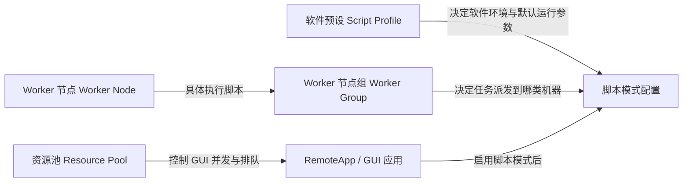

# 管理后台 Worker 与脚本配置设计说明手册

> 更新日期：2026-04-08  
> 适用范围：`frontend/admin.html`、`frontend/js/admin.js`、`backend/admin_router.py`、`backend/admin_worker_router.py` 以及相关 schema

## 1. 这次到底解决什么问题

旧版后台最大的问题不是“字段太多”，而是**对象关系没有讲明白**：

- 客户分不清 **资源池** 和 **Worker 节点组** 的区别。
- 客户分不清 **Worker 节点组** 和 **Worker 节点** 的区别。
- 客户不知道应用里的 **软件预设 / 执行器 / Worker 组** 三者到底谁决定了什么。
- 表单没有把“给系统看的参数”和“给人看的说明”拆开，结果填写全靠猜。

这次改造的目标很直接：

1. 让客户第一眼看懂对象关系。
2. 让每个关键字段都知道“为什么填、填错会怎样”。
3. 让后台接口返回更适合展示的聚合信息，而不是裸数据库字段。
4. 让 fresh init 的 schema 也具备 Worker / 脚本模式能力。

## 2. 核心对象关系

### 2.1 资源池是什么

资源池解决的是 **GUI 会话** 的并发和排队问题。它回答的是：

- 这个 RemoteApp 同时能开几个？
- 队列怎么放行？
- 会话多久算 stale / idle？

### 2.2 Worker 节点组是什么

Worker 节点组解决的是 **脚本任务派发范围**。它回答的是：

- 这一类脚本应该派发到哪一类机器？
- 这组机器是否具备相同软件、许可证和执行能力？

一句话：**节点组是机器类型，不是机器实例。**

### 2.3 Worker 节点是什么

Worker 节点是一台具体的 Windows 主机。它回答的是：

- 这台机器的 hostname 是什么？
- 它能访问哪个共享工作区？
- 它的本地 scratch 路径是什么？
- 它最近一次心跳和软件能力上报状态是什么？

> 现在脚本任务的**输入快照下载**和**输出结果回传**已经走 portal API 传输。`workspace_share` 仍然是节点资产的一部分，但脚本执行链路不再硬依赖“外部共享目录必须实时同步”这个脆弱前提。

### 2.4 软件预设是什么

软件预设是脚本模式的“环境模板”。它回答的是：

- 这类脚本默认需要什么软件适配器？
- 默认用哪个执行器？
- 是否需要指定 Python 可执行文件？
- 默认要注入哪些环境变量？

### 2.5 执行器是什么

执行器回答的是“**Worker 如何把脚本拉起来**”：

- `python_api`：直接用 Python 执行入口脚本。
- `command_statusfile`：通过命令行或批处理触发，再由状态文件/退出码判断结果。

## 3. 新后台的信息架构

### 3.1 Worker Tab

Worker 页现在分成三层：

1. **配置向导卡片**：先讲流程，不先扔表格。
2. **节点组表**：讲“环境类型”，看节点规模和说明。
3. **Worker 节点表**：讲“真实机器”，看注册状态、心跳、路径和软件能力。

### 3.2 应用管理 Tab

应用管理页增加了脚本模式说明卡片，并且脚本模式区现在明确拆成：

- 软件预设
- 执行器
- Worker 组
- scratch 覆盖
- Python 解释器覆盖
- 额外环境变量 JSON
- 配置结果预览

客户不用再猜“这些字段之间有没有关系”，因为界面会直接说清楚。

## 4. 后端逻辑改造点

### 4.1 `/api/admin/workers/groups`

返回节点组时，不再只给裸字段；新增：

- `node_count`
- `active_node_count`

这样前端可以直接展示“这组有多少机器、多少在线”。

### 4.2 `/api/admin/workers/nodes`

返回节点时新增最近注册码信息：

- `latest_enrollment_status`
- `latest_enrollment_issued_at`
- `latest_enrollment_expires_at`

同时保留并规整：

- `runtime_state_json`
- `capabilities_json`
- `software_inventory`
- `software_ready_count`
- `software_total_count`

这样前端能直接把“待注册 / 在线 / 离线 / 已吊销”讲成人话。

### 4.3 Worker 任务传输链路

为了解决 `assigned` 状态永久失联背后的更深层问题，脚本任务链路已经改为：

1. Worker 认领任务后，通过 `/api/worker/tasks/{task_id}/snapshot` 下载输入快照 zip；
2. Worker 在本机 scratch 中解压并执行；
3. Worker 完成后，通过 `/api/worker/tasks/{task_id}/output-archive` 上传输出 zip；
4. Portal 将输出解压回 `/drive/portal_u{user_id}/Output/{task_id}`；
5. 最后再由 Worker 调用 `complete_task` 写入结构化结果索引。

这一步的价值很直接：**脚本任务不再依赖外部共享盘同步是否正确。**

### 4.4 `/api/admin/script-profiles`

由配置文件驱动，统一把脚本软件预设暴露给前端。

前端选择软件预设后：

- 自动显示说明文本
- 自动带出执行器、Python 路径、环境变量默认值
- 再允许管理员做覆盖

### 4.5 应用创建 / 更新逻辑

应用在启用脚本模式时，后端会同步维护：

- `remote_app_script_profile`
- `catalog_app`
- `app_binding`（`gui_remoteapp` / `worker_script`）

这保证 GUI 模式和脚本模式可以同时存在，并且脚本绑定是结构化存储，不再靠前端私自拼字段。

## 5. 字段填写说明

## 5.1 节点组字段

### `group_key`

- 用途：系统内部稳定标识。
- 规则：短小、稳定、英文、小写，推荐 `ansys-solver`、`abaqus-batch` 这种格式。
- 不要干的事：拿机器名当组键，比如 `win-01`，这会把“机器类型”和“机器实例”混在一起。

### `name`

- 用途：给人看。
- 推荐写法：`ANSYS 求解节点组`、`Abaqus 批处理节点组`。
- 原则：客户看到名字就知道这组机器干什么。

### `description`

- 用途：补充软件、许可证、网络限制、用途边界。
- 推荐内容：
  - 运行软件
  - 许可证依赖
  - 适用任务
  - 不适用任务

### `max_claim_batch`

- 用途：单次认领的任务批量。
- 默认建议：`1`
- 只有在一台机器明确支持多任务并发拉取时才调大。

## 5.2 Worker 节点字段

### `display_name`

- 用途：后台展示名。
- 推荐写法：`CAE-ANSYS-01`、`Solver-Node-02`

### `expected_hostname`

- 用途：校验注册码和 Worker 实机身份。
- 必须等于该 Windows 机器执行 `hostname` 的结果。
- 填错后果：注册码签了也会注册失败。

### `scratch_root`

- 用途：Worker 本机执行时的临时目录。
- 必须是本机可写路径，例如 `C:\portal_worker_agent\scratch`。
- 不要填共享盘，因为执行期的中间文件应该先落本地。

### `workspace_share`

- 用途：Portal 用户空间在 Worker 侧可访问到的共享目录。
- 它必须是 Worker 能访问的路径，比如 UNC 共享或映射到本机的同步目录。
- 这是最容易填错的字段之一：**不能填 Portal 容器里的 `/drive/...` 路径。**

### `max_concurrent_tasks`

- 用途：单机可并行跑几个任务。
- 默认建议：`1`
- 只有机器资源、软件本身、许可证三者都允许并发时再调大。

## 5.3 应用脚本模式字段

### `script_enabled`

- 打开后，这个应用除了 GUI RemoteApp，还会多一条“脚本派发”能力。

### `script_profile_key`

- 作用：选择软件环境模板。
- 它决定默认的软件适配器、默认执行器、默认 Python 环境。

### `script_executor_key`

- 作用：决定 Worker 怎么执行任务。
- `python_api` 适合纯 Python 驱动。
- `command_statusfile` 适合 bat/cmd 或外部命令行触发。

### `script_worker_group_id`

- 作用：决定脚本派发到哪一类机器。
- 这是最重要的路由字段之一。
- 没选它，就相当于你告诉系统“我要跑脚本，但没告诉你去哪跑”。

### `script_scratch_root`

- 作用：覆盖节点默认 scratch。
- 一般留空。
- 只有某个应用必须写到固定目录时才单独配置。

### `script_python_executable`

- 作用：覆盖预设默认 Python。
- 仅在某个应用必须绑定特定解释器时填写。

### `script_python_env`

- 作用：补充运行时环境变量。
- 格式必须是 JSON 对象。
- 典型场景：许可证地址、软件缓存路径、自定义运行参数。

## 6. UI 展示原则

这次后台界面遵循下面几个硬规则：

1. **先讲关系，再给字段。**
2. **先给人话，再给参数。**
3. **把“系统标识”和“展示名称”明确分开。**
4. **状态必须可解释，不允许只显示 `active` / `pending_enrollment` 这种数据库词。**
5. **任何客户容易填错的字段，都必须带后果提示。**

## 7. Fresh Init / Schema 变更

本次更新把以下对象纳入初始化脚本：

- `catalog_app`
- `app_binding`
- `remote_app_script_profile`
- `worker_group`
- `worker_node`
- `worker_enrollment`
- `worker_auth_token`
- `platform_task`
- `platform_task_log`
- `platform_task_artifact`

并补齐：

- `launch_queue.request_mode`
- `launch_queue.platform_task_id`
- `remote_app.disable_download`
- `remote_app.disable_upload`

这样新的部署环境不会再出现“前端有功能，schema 没跟上”的傻逼问题。

## 8. 验证闭环

本次实现完成后，至少验证以下内容：

1. Worker 与脚本预设相关 Python 单测通过。
2. 管理台引导文案与 helper 函数的 Node 测试通过。
3. 后端关键模块 `py_compile` 通过。
4. 本地启动后台成功，`/health` 返回正常。
5. 浏览器真实打开后台：
   - Worker 页能看到 3 张配置向导卡片。
   - Worker 节点表头能看到“注册 / 心跳”“路径配置”“软件能力”。
   - 应用编辑弹窗里能看到“脚本模式怎么填”和配置结果预览。

## 9. 最后的判断

如果一个客户还需要去问“节点组和节点到底有什么区别”，那不是客户不懂，是后台设计失败。

这次改造的标准不是“字段还能不能填进去”，而是：

- 客户能否在第一次打开页面时建立正确心智模型；
- 实施同事能否按页面提示完成配置，而不是翻后端代码；
- 错误是否在输入阶段就被解释清楚，而不是等到任务失败后才追日志。
