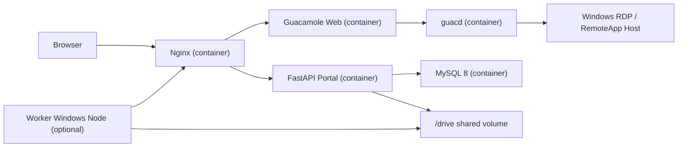
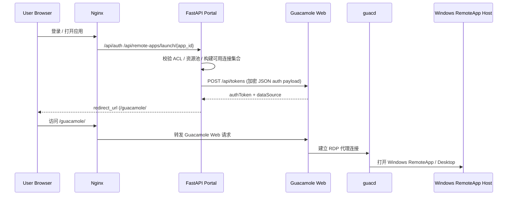
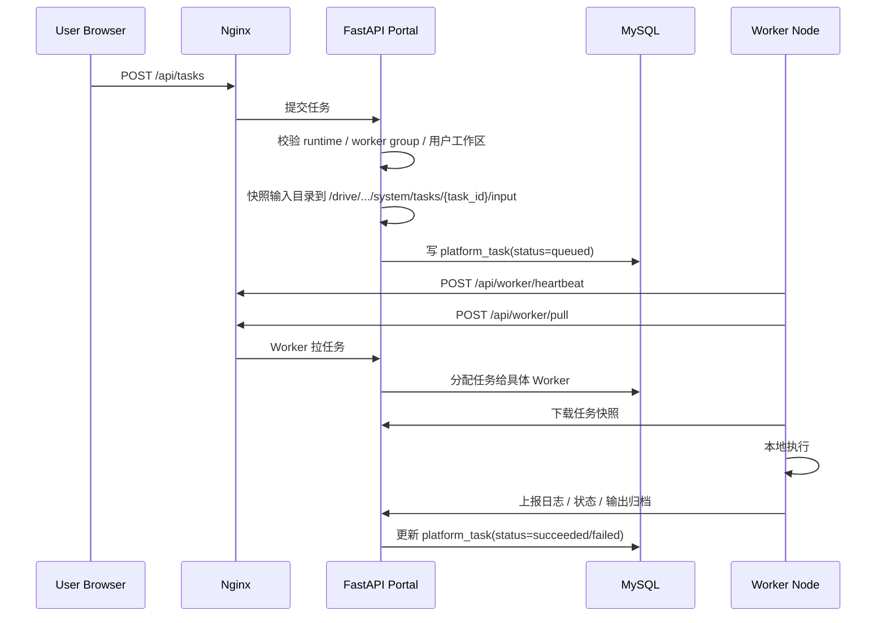

# 生产服务器部署说明手册

> 更新日期：2026-04-10  
> 适用范围：`deploy/docker-compose.yml`、`deploy/.env`、`deploy/nginx/conf.d/portal.conf`、`backend/app.py`、`backend/router.py`、`backend/task_router.py`、`backend/task_service.py`、`backend/worker_router.py`、`backend/worker_service.py`、`config/config.json`

## 1. 先把最容易搞混的事说死

### 1.1 `bridge` 不是生产架构

当前开发机上出现过的 `8880 -> 18880` 桥接，只是 **Windows + Docker Desktop + WSL2** 环境下为了收敛端口暴露问题加的临时补丁。

**真正的生产服务器部署，不应该依赖 `deploy/host_port_bridge.py`。**

一句话：

- **生产 Linux 服务器：不需要 bridge。**
- **Windows 开发机：bridge 只是临时本机调试补丁。**

### 1.2 生产环境真正应该长什么样

推荐生产拓扑只有这一条主线：



如果还需要画第二条线，那也应该是：

- **外层正式反向代理 / LB / HTTPS 网关**  
  `Internet -> TLS Reverse Proxy -> Portal Nginx`

而不是：

- `Internet -> 随手写的 TCP bridge -> Nginx`

这两者不是一个级别的东西，别混。

## 2. 整个软件到底是什么

这个项目不是单纯的 Guacamole 演示页，而是一个 **RemoteApp 门户系统**。

它做两件事：

1. **RemoteApp / GUI 访问**  
   用户登录门户，点击应用卡片，系统把用户送进对应的 Guacamole 会话。
2. **脚本任务派发（可选）**  
   用户提交脚本任务，系统把任务快照派发给 Windows Worker 节点执行，再回收结果。

### 2.1 组件职责

| 组件 | 位置 | 职责 |
|---|---|---|
| Nginx | `deploy/nginx/conf.d/portal.conf` | 统一对外入口，转发 `/api`、`/guacamole/`、静态页 |
| Portal Backend | `backend/app.py` | FastAPI 主服务，挂载所有业务路由 |
| Guacamole Web | Docker `guac-web` | Guacamole Web UI 与 token 接收端 |
| guacd | Docker `guacd` | RDP 协议代理 |
| MySQL | Docker `guac-sql` | Guacamole 核心库 + Portal 业务库 |
| Drive Volume | `/drive` | 用户个人空间、任务快照、任务输出 |
| Worker Node | 独立 Windows 主机 | 执行脚本任务，向 `/api/worker/*` 心跳和拉任务 |

### 2.2 关键代码入口

- Portal 主入口：`backend/app.py`
- RemoteApp 启动路由：`backend/router.py`
- Guacamole token / session 复用：`backend/guacamole_service.py`
- 任务路由：`backend/task_router.py`
- 任务编排：`backend/task_service.py`
- Worker API：`backend/worker_router.py`
- Worker 调度与心跳：`backend/worker_service.py`

## 3. 业务流

## 3.1 登录与 RemoteApp 启动流



关键点：

1. 门户不是把用户直接扔给 Guacamole 登录页。
2. 门户后端会自己生成 Guacamole token。
3. **同一门户用户复用同一个 Guacamole session token**，避免浏览器多标签互相覆盖。
4. 对外跳转地址会优先跟随请求头里的 Host，避免把用户重定向到错误地址。

## 3.2 脚本任务流



关键点：

1. 输入不是直接在共享目录上“原地跑”，而是先做快照。
2. Worker 会不断 heartbeat 和 pull，不是门户主动推送。
3. 任务输出会回传到 Portal，再落回 `/drive` 和数据库记录。

## 4. 生产部署时哪些部分一定要分清

### 4.1 这是三套地址，不是一套

部署时最容易脑子打结的就是把下面三件事混成一坨：

1. **Portal 外部访问地址**  
   用户浏览器访问的地址，比如 `portal.example.com:8880`
2. **容器内部服务地址**  
   例如 `http://guac-web:8080/guacamole`
3. **Windows RemoteApp 主机地址**  
   即 `remote_app.hostname` 里写的 Windows 机器地址，比如 `10.10.20.15`

这三个地址根本不是一个概念。

### 4.2 `PORTAL_HOST` 不是 RDP 主机

`deploy/.env` 里的：

- `PORTAL_HOST`
- `PORTAL_BIND_IP`
- `PORTAL_PORT`

控制的是 **门户自己** 怎么对外暴露。

数据库 `remote_app.hostname` 控制的是 **Guacamole 最终连哪台 Windows 主机**。

如果你把这俩混了，表面上 portal 能打开，点应用照样死。

### 4.3 `config/config.json` 主要是默认值，不是 Docker 生产总开关

Portal 在 Docker 里运行时，数据库和 Guacamole 相关配置会被环境变量覆盖，见：

- `backend/config_loader.py:20`
- `backend/config_loader.py:28`
- `backend/config_loader.py:34`
- `backend/config_loader.py:37`

所以：

- **生产部署优先改 `deploy/.env`**
- **不要优先去手改 `config/config.json` 里的 DB 地址**

`config/config.json` 更像：

1. 默认值仓库
2. 脚本 profile 配置仓库
3. drive / monitor / quota 的静态配置仓库

## 5. 推荐的生产部署模式

## 5.1 模式 A：Portal 自己直接对外提供 HTTP 端口

适合：

- 内网环境
- VPN 内部访问
- 你先不接 HTTPS 网关

推荐：

- `PORTAL_BIND_IP=0.0.0.0`
- `PORTAL_PORT=8880`
- `PORTAL_HOST=portal.example.com` 或服务器 IP

优点：

- 简单
- 直接

缺点：

- 当前仓库里的 Nginx 配置默认没有 TLS 终止
- 如果要公网暴露，安全感不够

## 5.2 模式 B：Portal 只监听本机，前面再挂正式反向代理 / HTTPS

适合：

- 公网
- 需要 443 / TLS
- 需要统一证书、WAF、LB

推荐：

- `PORTAL_BIND_IP=127.0.0.1`
- `PORTAL_PORT=18880`
- 外层 Nginx / Caddy / Traefik / SLB 反代到 `127.0.0.1:18880`

优点：

- 结构更标准
- TLS 更干净
- 后续扩展更稳

缺点：

- 多一层正式代理配置

## 5.3 我不推荐的模式

### 不推荐 1：生产 Windows Server + Docker Desktop + bridge

能跑，但很丑，且排障成本高。

### 不推荐 2：继续沿用开发机的 `192.168.56.x` VMware 配置

这明显是本机虚拟网卡环境，不是服务器配置。

## 6. 生产服务器准备清单

## 6.1 服务器建议

- 操作系统：Linux
- Docker Engine + Docker Compose 插件
- 足够的磁盘给 MySQL 和 `/drive`
- 稳定的 DNS / 主机名
- 能访问目标 Windows RemoteApp 主机的 3389

## 6.2 网络准备

如果你只提供门户：

- 开放 Portal 端口（例如 8880 或 80 / 443）

如果你还跑 Worker：

- Worker 节点要能访问 Portal 的 `/api/worker/*`

如果你有 RDP 主机：

- `guacd` 所在容器网络能到 Windows 主机 `3389`

## 6.3 宿主机目录准备

生产环境建议显式绑定宿主机目录，而不是继续靠 Docker named volume。

示例：

```bash
sudo mkdir -p /srv/nercar-portal/mysql
sudo mkdir -p /srv/nercar-portal/drive
sudo chown -R 999:999 /srv/nercar-portal/mysql || true
sudo chmod -R 755 /srv/nercar-portal/drive
```

> MySQL 数据目录必须放在 Linux 本地文件系统上，别放奇怪的大小写不敏感共享盘。

## 7. 生产配置说明

## 7.1 `deploy/.env` 是生产部署主配置

建议在生产上至少设置这些值：

```ini
# 实例名
PORTAL_INSTANCE_ID=nercar-portal-prod

# MySQL
MYSQL_ROOT_PASSWORD=请改成强密码
MYSQL_USER=guacamole_user
MYSQL_PASSWORD=请改成强密码
MYSQL_DATABASE=guacamole_db

# Guacamole JSON auth 密钥
JSON_SECRET_KEY=请改成新的128位hex密钥

# Portal
PORTAL_HOST=portal.example.com
PORTAL_BIND_IP=0.0.0.0
PORTAL_PORT=8880
PORTAL_JWT_SECRET=请改成新的强密钥

# Linux 生产持久化目录
MYSQL_DATA_SOURCE=/srv/nercar-portal/mysql
GUAC_DRIVE_SOURCE=/srv/nercar-portal/drive

# 时区
TZ=Asia/Shanghai
```

### 字段解释

| 变量 | 作用 | 生产建议 |
|---|---|---|
| `PORTAL_INSTANCE_ID` | compose 项目名 / volume 前缀 | 每套实例唯一 |
| `MYSQL_ROOT_PASSWORD` | Portal 连接 portal DB 的 root 密码 | 必改强密码 |
| `MYSQL_PASSWORD` | Guacamole 自己连 `guacamole_db` 的业务用户密码 | 必改强密码 |
| `JSON_SECRET_KEY` | Portal 和 Guacamole 共享的 JSON auth 密钥 | 必改 |
| `PORTAL_HOST` | 用户实际访问门户的主机名 / IP | 写真实域名或真实 IP |
| `PORTAL_BIND_IP` | Nginx 在宿主机绑定的地址 | Linux 直接对外时写 `0.0.0.0` |
| `PORTAL_PORT` | Nginx 在宿主机发布的端口 | 常见是 `8880`、`80` |
| `PORTAL_JWT_SECRET` | 门户 JWT 签名密钥 | 必改 |
| `MYSQL_DATA_SOURCE` | MySQL 数据目录 | 生产强烈建议显式设置 |
| `GUAC_DRIVE_SOURCE` | `/drive` 目录 | 生产强烈建议显式设置 |

## 7.2 `config/config.json` 哪些值是你可能还要改的

这个文件在 Docker 里主要保留三类值：

1. **脚本 profile**
2. **monitor / quota**
3. **drive 行为**

重点关注：

- `guacamole.drive.base_path`：默认 `/drive`
- `guacamole.drive.results_root`：默认 `Output`
- `script_profiles.*`：脚本任务的软件预设

如果你只是部署 RemoteApp 门户，不改脚本执行能力，这个文件通常不用碰。

如果你要跑脚本任务，要重点看：

- `config/config.json:99`
- `config/config.json:113`

特别是：

- `python_executable_env`
- `python_env`

这些值必须和 Worker 节点的软件环境匹配。

## 7.3 Docker Compose 里真正起作用的生产变量

Portal 容器启动时，核心变量是：

- `PORTAL_DB_HOST=guac-sql`
- `PORTAL_DB_PORT=3306`
- `GUACAMOLE_INTERNAL_URL=http://guac-web:8080/guacamole`
- `GUACAMOLE_EXTERNAL_URL=http://${PORTAL_HOST}:${PORTAL_PORT}/guacamole`

见 `deploy/docker-compose.yml:78` 到 `deploy/docker-compose.yml:84`。

这意味着：

1. 容器内部访问 Guacamole 永远走 `guac-web:8080`
2. 对外回跳地址默认按 `PORTAL_HOST + PORTAL_PORT`
3. 但实际 RemoteApp 启动时还会尽量跟随请求头动态修正外部地址

## 8. 业务数据也要改，不是只改 `.env`

## 8.1 `remote_app` 表必须确认

当前库里示例数据的 Windows 主机还是：

- `192.168.56.6`

这显然是开发环境残留。

如果生产上的 Windows RemoteApp 主机不是这个地址，你必须改 `remote_app.hostname`。

要核对的字段：

- `hostname`
- `port`
- `remote_app`
- `remote_app_dir`
- `remote_app_args`
- `pool_id`

## 8.2 ACL 和资源池也要确认

要核对这些表：

- `remote_app`
- `remote_app_acl`
- `resource_pool`
- `resource_pool_member`

否则你可能遇到：

- 门户能登录，但看不到应用
- 看得到应用，但点开排队异常
- 资源池放行逻辑和生产并发不匹配

## 8.3 如果启用脚本任务，还要核对这些表

- `app_binding`
- `worker_group`
- `worker_node`
- `worker_enrollment`
- `worker_auth_token`

说人话：

- 脚本任务不是“portal 部署好就自动能跑”
- Worker 节点是额外的一套运维对象

## 9. 启动步骤

## 9.1 第一步：进入部署目录

```powershell
cd deploy
```

> 生产部署以 `deploy/docker-compose.yml` 为准，不要误用仓库根目录那个旧 `docker-compose.yml`。

## 9.2 第二步：确认 `.env`

```powershell
Get-Content .env
```

重点确认：

- 没有开发机 IP
- 没有弱密码
- 持久化目录已经配置

## 9.3 第三步：启动整套服务

```powershell
docker compose up -d --build
```

这一步会启动：

- `guacd`
- `guac-sql`
- `guac-web`
- `portal-backend`
- `nginx`

## 9.4 第四步：看状态

```powershell
docker compose ps
```

正常应该看到：

- `guac-sql` healthy
- `portal-backend` up
- `nginx` up

## 9.5 第五步：健康检查

如果 portal 直接对外暴露：

```powershell
curl http://127.0.0.1:8880/health
```

或：

```powershell
curl http://portal.example.com:8880/health
```

预期返回：

```json
{"status":"ok"}
```

## 10. 启动后怎么验收

## 10.1 Portal 自身验收

1. 登录页能打开
2. 管理员能登录
3. 用户能看到应用卡片
4. 点击 RemoteApp 能进入 Guacamole

## 10.2 数据库验收

```powershell
docker compose exec -T guac-sql mysql -uroot -p你的密码 --default-character-set=utf8mb4 -e "SHOW DATABASES"
```

至少应该有：

- `guacamole_db`
- `guacamole_portal_db`

## 10.3 业务数据验收

```powershell
docker compose exec -T guac-sql mysql -uroot -p你的密码 --default-character-set=utf8mb4 guacamole_portal_db -e "SELECT id, name, hostname, port FROM remote_app"
```

重点看：

- `hostname` 是否已经换成生产 Windows 主机
- 不是开发 IP

## 10.4 Worker 验收（如果启用脚本任务）

```powershell
docker compose exec -T guac-sql mysql -uroot -p你的密码 --default-character-set=utf8mb4 guacamole_portal_db -e "SELECT id, expected_hostname, hostname, status, last_heartbeat_at FROM worker_node"
```

你要看到：

- 对应 Worker 节点是 `active`
- `last_heartbeat_at` 在持续更新

## 11. Worker 部署说明（仅脚本任务需要）

## 11.1 Worker 不是 Portal 容器的一部分

Worker 是独立 Windows 主机，不在 `docker compose` 里面。

Portal 侧只是：

1. 保存 Worker 节点元数据
2. 发 enrollment token
3. 接收心跳和任务回传

## 11.2 Worker 上必须具备的东西

- 能访问 Portal 地址
- 本地 scratch 目录
- 对应的软件环境
- 对应的 Python 或命令行执行器

## 11.3 Worker 上线最少要做的事

1. 在后台创建 `Worker Group`
2. 创建 `Worker Node`
3. 确认 `expected_hostname` 与实际主机名完全一致
4. 确认 `scratch_root`、`workspace_share` 正确
5. 签发 enrollment token
6. 在 Worker 主机上用该 token 注册
7. 保证 Worker 进程常驻运行

## 11.4 老实说一句

当前仓库里的 Worker 能跑，但 **运维打包和安装流程还不够产品化**。

也就是说：

- Portal 部分已经是“系统”
- Worker 部分还更像“工程能力”

如果你计划大规模正式启用脚本任务，后续最好单独补一份：

- Worker 安装手册
- Worker Windows Service 标准化方案
- Worker 升级 / 回滚流程

## 12. 日常运维命令

## 12.1 看日志

```powershell
docker compose logs -f nginx
docker compose logs -f portal-backend
docker compose logs -f guac-web
docker compose logs -f guacd
docker compose logs -f guac-sql
```

## 12.2 重启服务

```powershell
docker compose restart nginx portal-backend
docker compose restart guac-web
```

## 12.3 全量重建

```powershell
docker compose up -d --build
```

## 12.4 备份提醒

需要备份两样东西：

1. `guacamole_db` + `guacamole_portal_db`
2. `/drive`

导出数据库时务必带：

```powershell
--default-character-set=utf8mb4
```

否则中文迟早乱码。

## 13. 生产上不该做的蠢事

### 13.1 不要把 `PORTAL_HOST` 留成开发机 IP

现在 `.env` 里那种 `192.168.56.25` 就是开发残留。

### 13.2 不要继续用 bridge

生产 Linux 不需要它。  
如果你发现自己又想把 `host_port_bridge.py` 搬上服务器，先停手，说明你的入口设计已经歪了。

### 13.3 不要把 MySQL 对公网开放

当前 compose 已经把 MySQL 绑定到 `127.0.0.1`，这是对的。

### 13.4 不要忘了改 `remote_app.hostname`

这比没改密码还常见，而且更阴险。因为 portal 表面看起来都正常，只有点应用时才爆炸。

### 13.5 不要拿根目录旧 compose 起服务

真正入口是：

- `deploy/docker-compose.yml`

不是仓库根目录那个旧版 compose。

## 14. 推荐的生产上线顺序

1. 准备 Linux 服务器
2. 准备数据目录
3. 改 `deploy/.env`
4. 启动 `docker compose up -d --build`
5. 验证 `/health`
6. 校验数据库和 `remote_app` 业务数据
7. 登录门户测试 RemoteApp
8. 如果启用脚本任务，再单独上线 Worker

## 15. 最后的结论

这个项目的生产部署主线并不复杂：

- **Portal 容器栈** 负责入口、认证、RemoteApp 启动、任务编排
- **Windows 主机** 负责真正运行 RemoteApp
- **Worker 节点** 负责可选的脚本任务执行

真正该记住的只有三句话：

1. **生产服务器不需要 bridge，bridge 只是开发机补丁。**
2. **生产部署优先改 `deploy/.env`，不是优先乱改 `config/config.json`。**
3. **别忘了改数据库里的 `remote_app.hostname` 和 Worker 元数据，那才是业务真正连到哪台机器。**
