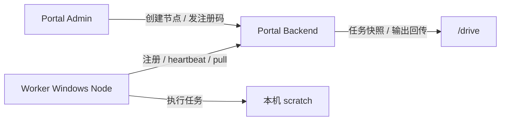
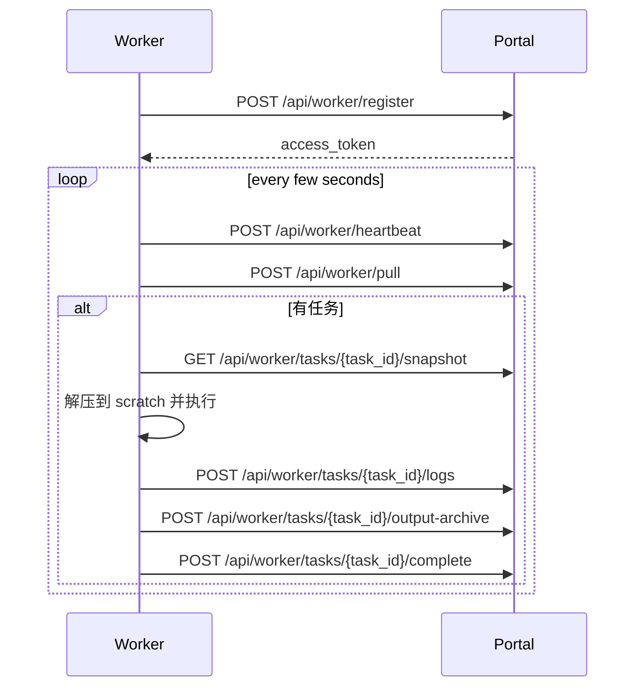

# Worker 安装与上线手册

> 更新日期：2026-04-10  
> 适用范围：当前仓库中的 Worker 能力，即 `backend/worker_bootstrap.py`、`backend/worker_agent.py`、`backend/worker_host.py`、`backend/worker_runtime.py`、`backend/worker_service.py`  
> 目标读者：实施、运维、测试工程师

## 1. 先说清楚当前状态

当前 Worker **能跑**，但还不是“客户拿安装包双击下一步就能稳定上线”的产品。

它现在具备的是：

1. Portal 后台可以创建 Worker Group / Worker Node / Enrollment Token
2. Worker 端可以用注册码注册
3. Worker 会持续 heartbeat、pull task、执行、回传结果
4. 支持 `python_api` 和 `command_statusfile` 两种执行器

它现在**还不具备**的是：

1. 官方一键安装器
2. 官方一键注册器
3. 标准化 Windows Service 安装脚本
4. 标准化升级器 / 回滚器

所以这份手册本质上是：

- **基于当前代码现状的可操作安装手册**
- 不是“假装已经产品化”的吹牛文档

## 2. Worker 在整个系统里的角色



Worker 回答的是一句话：

> “哪台 Windows 机器，按什么执行器，拿什么环境，把哪个脚本任务跑掉。”

## 3. 当前 Worker 运行原理

当前 Worker 主循环由三层拼起来：

1. `backend/worker_bootstrap.py`
   - 读取 `registration.json`
   - 组装 `WorkerAgent`
2. `backend/worker_agent.py`
   - 注册
   - heartbeat
   - pull task
   - 下载快照
   - 执行
   - 上传结果
3. `backend/worker_host.py`
   - 按固定间隔不停调用 `run_once()`

简化后的运行流程：



## 4. 安装前提

## 4.1 Portal 侧前提

Portal 侧必须已经具备这些能力：

1. Worker API 已启动
2. 管理后台能创建 Worker Group / Worker Node
3. 数据库 `worker_*` 相关表已存在
4. 至少存在一个可用的脚本模式目标应用和绑定

## 4.2 Worker 主机前提

Worker 主机必须满足：

1. Windows
2. 能访问 Portal 地址
3. 有本地可写 scratch 路径
4. 有本地可写状态目录
5. 具备目标脚本需要的软件环境

如果你要跑 `python_api`：

6. 有可用 Python

如果你要跑特定软件预设，例如 `ansys_mapdl`：

7. 目标软件和 Python 模块都已安装

## 4.3 你必须提前想明白的三个值

### `expected_hostname`

这是 Portal 后台保存的“这台机器应该叫什么”。

Worker 注册时会严格校验：

- `hostname`
- `machine_fingerprint`
- `scratch_root`
- `workspace_share`

只要这些对不上，就会被判定为 `worker_identity_conflict`。

### `scratch_root`

这是 Worker 本机执行目录。

建议：

- 放本地盘
- 不放网络共享
- 不放用户桌面这种脏地方

推荐类似：

- `C:\portal_worker_agent\scratch`

### `workspace_share`

当前实现里，它仍然是节点资产字段，必须与 Portal 中节点配置一致。

但要注意：

> 当前脚本执行链路已经改成“快照下载 + 结果回传”，不再要求 Worker 直接在共享盘上原地执行。

所以它现在更像：

- 资产声明
- 身份校验字段
- 未来扩展保留位

而不是硬依赖的执行目录。

## 5. 推荐目录结构

当前虽然没有官方安装器，但我建议从第一天起就统一目录结构。

推荐：

```text
C:\portal_worker_agent\
├── registration.json          # 注册配置
├── run_worker.py              # 启动入口脚本
├── logs\                      # Worker 日志
├── runtime\                   # 可选：运行期文件
└── scratch\
    ├── .worker-state\         # token / state
    └── jobs\                  # 每个任务的 scratch 解压目录
```

如果后续做正式安装包，这个目录结构最好别乱改。

## 6. Portal 侧准备步骤

## 6.1 创建 Worker Group

在管理后台创建节点组，至少要填：

- `group_key`
- `name`
- `max_claim_batch`

建议：

- `group_key` 稳定、英文、小写
- `max_claim_batch` 初期保持 `1`

## 6.2 创建 Worker Node

在管理后台创建 Worker 节点时，至少确认：

- `display_name`
- `expected_hostname`
- `scratch_root`
- `workspace_share`
- `max_concurrent_tasks`

最常见的错误不是代码，而是你把 `expected_hostname` 填错了。

## 6.3 签发 Enrollment Token

创建节点后，从后台签发注册码。

当前设计里：

- Enrollment Token 用于第一次注册
- Access Token 用于注册后的长期认证

这俩不是一回事，别混。

## 7. Worker 主机安装步骤（当前可执行版本）

## 7.1 准备 Python 环境

至少要准备一个可用 Python。

如果你准备沿用仓库里的运行方式，推荐：

```powershell
python -m venv C:\portal_worker_agent\venv
C:\portal_worker_agent\venv\Scripts\pip.exe install -r requirements.txt
```

如果你直接复用仓库工作副本，也可以直接使用仓库自己的 `.venv`，但这更像开发方式，不像产品安装方式。

## 7.2 准备 Worker 目录

```powershell
New-Item -ItemType Directory -Force C:\portal_worker_agent\logs
New-Item -ItemType Directory -Force C:\portal_worker_agent\scratch
New-Item -ItemType Directory -Force C:\portal_worker_agent\scratch\.worker-state
```

## 7.3 写 `registration.json`

这是当前 Worker 安装里最关键的文件。

最小示例：

```json
{
  "portal_base_url": "http://portal.example.com:8880",
  "enrollment_token": "enr_xxx",
  "hostname": "WIN-WORKER-01",
  "machine_fingerprint": "fp-WIN-WORKER-01",
  "agent_version": "dev-local",
  "os_type": "windows",
  "os_version": "10.0.26100",
  "ip_addresses": [
    "10.10.20.31"
  ],
  "scratch_root": "C:\\portal_worker_agent\\scratch",
  "workspace_share": "C:\\portal_worker_share",
  "max_concurrent_tasks": 1,
  "supported_executor_keys": [
    "python_api"
  ],
  "capabilities": {
    "can_run_script_binding": true,
    "can_run_gui_binding": false
  }
}
```

注意：

1. `portal_base_url` 必须是 Worker 能访问到的 Portal 地址
2. `hostname` 必须等于后台节点里配置的 `expected_hostname`
3. `scratch_root` / `workspace_share` 必须与后台节点配置完全一致

## 7.4 写启动脚本

当前没有官方 CLI，所以通常要写一个很薄的本地启动脚本。

示意：

```python
import sys
from pathlib import Path

REPO_ROOT = Path(r"D:\gucamole_app")
if str(REPO_ROOT) not in sys.path:
    sys.path.insert(0, str(REPO_ROOT))

from backend.worker_bootstrap import build_worker_agent
from backend.worker_host import WorkerHost

registration_path = Path(r"C:\portal_worker_agent\registration.json")
agent = build_worker_agent(registration_path)
WorkerHost(agent=agent, interval_seconds=5.0).run()
```

这不是优雅，而是当前代码状态下最直接的办法。

## 7.5 首次手工启动

先别一上来就装成 Service，先前台跑通。

```powershell
python -u C:\portal_worker_agent\run_worker.py
```

你至少要看到：

1. 注册成功
2. Worker 状态变成 `active`
3. 后台里 `last_heartbeat_at` 持续刷新

如果连前台跑都跑不通，就别急着谈服务化。

## 8. 首次上线验收

## 8.1 Portal 数据库验收

```sql
SELECT id, expected_hostname, hostname, status, last_heartbeat_at
FROM worker_node;
```

预期：

- `status = active`
- `hostname` 已回填
- `last_heartbeat_at` 在刷新

## 8.2 脚本任务验收

必须至少拿一个简单任务做 smoke test。

不要拿真实大任务上来就赌。

建议：

1. 用最小脚本任务
2. 只验证执行器通路
3. 观察日志、状态、输出回传

## 8.3 软件能力验收

当前 Worker heartbeat 会把 `software_inventory` 上报回来。

你要核对：

- 所需软件是否显示 `ready`
- 目标节点是否真的能被调度

## 9. 常见故障

## 9.1 `worker_identity_conflict`

最常见原因：

- `expected_hostname` 不匹配
- `machine_fingerprint` 不匹配
- `scratch_root` 不匹配
- `workspace_share` 不匹配

这不是代码锅，九成是你配置填错。

## 9.2 `invalid_enrollment_token`

说明注册码不对，或已经过期 / 被消费。

做法：

- 重新签发 enrollment token

## 9.3 Worker 在线但不接任务

检查：

1. 节点是否 `active`
2. `supported_executor_keys_json` 是否包含目标执行器
3. 目标应用是否绑定到了正确 `worker_group`
4. `software_inventory` 是否 ready
5. `max_concurrent_tasks` 是否已占满

## 9.4 任务一认领就失败

通常看这几个方向：

1. Python 不存在
2. 软件模块不存在
3. 目标执行器配置错
4. `python_env` 不匹配
5. scratch 路径没权限

## 10. 当前手册的边界

这份手册能覆盖的是：

- 当前代码状态下如何把 Worker 装起来并上线

它还不能替代的是：

- 标准化 Windows Service 安装手册
- 标准化升级 / 回滚流程
- 官方安装器说明书

这些需要单独补。

## 11. 最后一句狠话

如果你连：

- 主机名
- scratch 路径
- workspace 路径
- enrollment token

这几个最基础的东西都没对齐，就别骂 Worker 不稳定。那不是系统复杂，是部署太糙。
